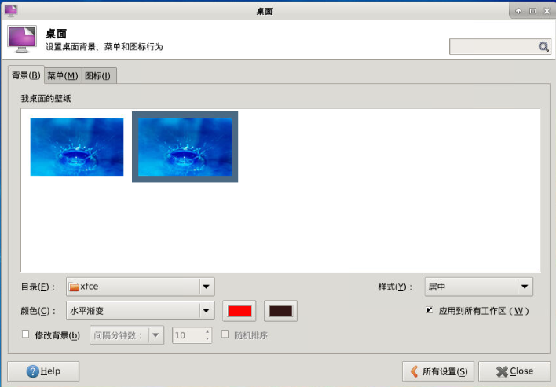
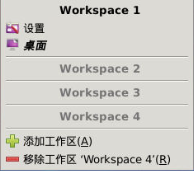
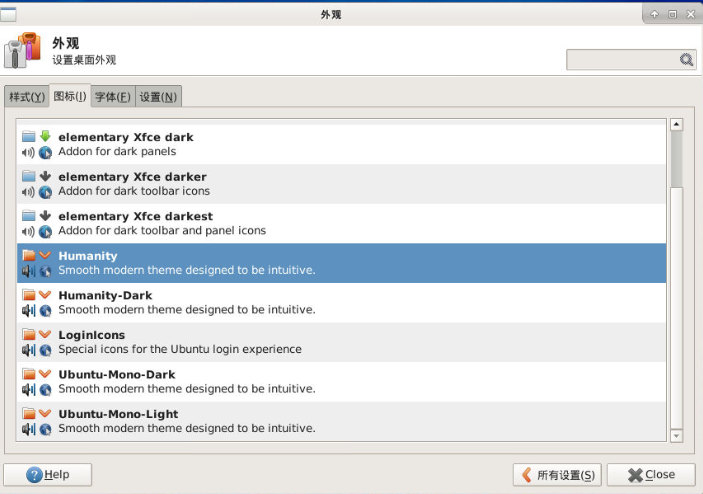
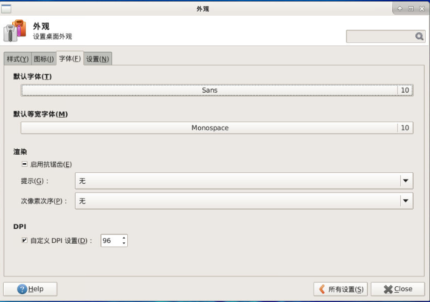
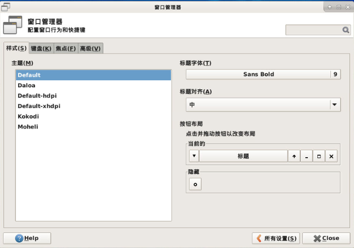
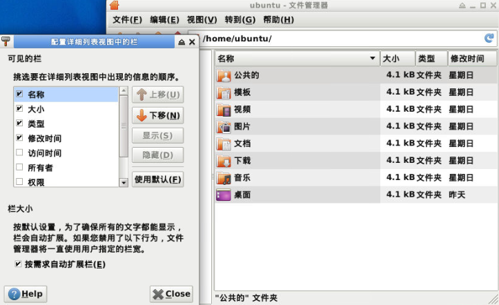
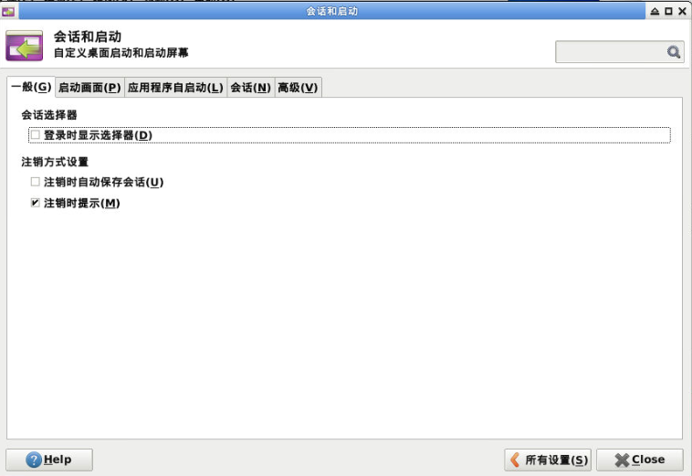
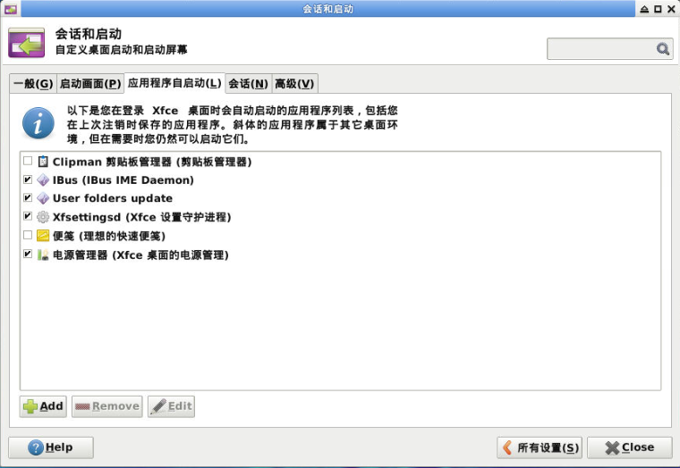
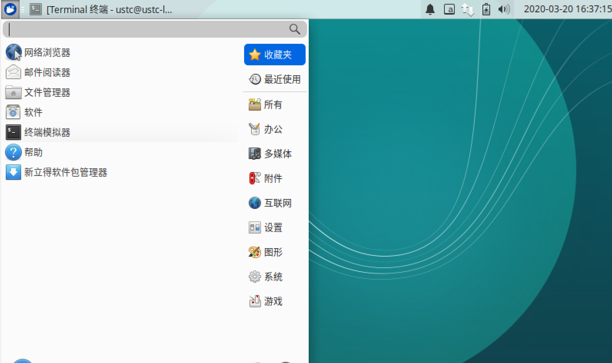
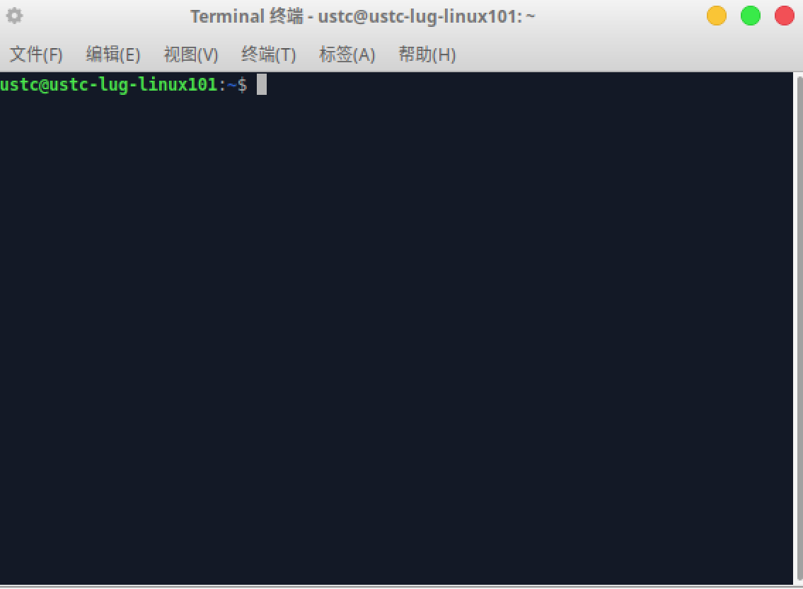

# 个性化配置与建站体验

!!! success "本文已完稿并通过审阅，是正式版本。"

!!! abstract "导言"

    Linux 是一个可以高度个性化定制的系统，当然也包括界面的个性化，因此本章节将带大家解决这些问题：

    * 如何选择并安装桌面环境
    * 如何打造自己独特的桌面
    * 如何配置美化命令行终端
    * 如何简单快速地搭建网站

## 桌面环境 {#desktop-environment}

Linux 本身并不包括图形界面。没有图形界面的 Linux 系统，只能通过命令行来管理。

Linux 中的桌面环境也是一个程序，它和内核不是绑定的，两者的开发也不是同步的；给不带界面的 Linux 系统安装上一个桌面环境，你就能看到各种漂亮的窗口，并能用鼠标点击它们了。

### 桌面环境的选择

Linux 的桌面环境可不止一种，下面介绍几个流行的桌面环境。

#### KDE Plasma

KDE 软件社区提供的 Plasma Linux 桌面环境是最可定制的图形桌面环境之一。此功能丰富且功能强大的桌面环境还拥有许多小部件。它允许用户自由地添加桌面的控制面板。
[Plasma 官方网站](https://www.kde.org/plasma-desktop)

#### GNOME

GNOME 的设计目标是为用户提供简单性，易于访问性和可靠性。正因为这些，GNOME 得到了普及。
[GNOME 官网](https://www.gnome.org/)

#### Xfce

Xfce 是一款快速、轻量，界面美观和对用户友好的桌面环境。
[Xfce 官网](https://www.xfce.org/)

!!! info ""

    除了上面的桌面环境，常见的还有 Cinnamon, Unity 等，同学们可以自行了解。

!!! tip "提示"

    如果你想要安装其它桌面系统（如 GNOME）或者你的系统未预装好桌面环境，可以参阅拓展阅读的内容。

本次教学所用的系统 Xubuntu 预先安装了 Xfce 桌面环境，因此本章将主要围绕 Xfce 的个性化来开展。实际上无论是哪一款桌面系统，个性化的方式都大同小异。

### 常用外观个性化 {#appearance-settings}

跟 Windows 系统一样，大部分 Linux 桌面环境个性化功能并不比 Windows 差。

我们直接打开 Xfce 中的设置管理器，如图所示。


图 1. 设置管理器的位置
{: .caption }

这里最常见的设置，都可以找得到。


图 2. 设置管理器
{: .caption }

#### 桌面 {#desktop}

xfdesktop 桌面管理器是 Xfce 中的一个主要模块，它负责在桌面上设置背景图像/颜色和绘制图标。当你分别用鼠标右键或鼠标中键单击桌面时，它可以显示应用程序菜单和所有正在运行的应用程序的列表。

##### 背景 {#desktop-background}



图 3. 桌面背景首选项
{: .caption }

背景设置是对壁纸的更改和个性化。

下表是一些配置的补充说明。

| 字段     | 功能                                                                         |
| -------- | ---------------------------------------------------------------------------- |
| 目录     | 存放壁纸的目录。                                                             |
| 样式     | 壁纸的显示样式、包括居中、平铺等。                                           |
| 颜色     | 用于填充背景空缺部分的颜色，可以设置纯色、渐变、透明。                       |
| 修改背景 | 如果一个位置包含多张图像，则 Xfce 允许你通过循环浏览可用图像来自动更改背景。 |

##### 菜单 {#desktop-menus}


图 4. 桌面菜单首选项
{: .caption }

Xfce 允许用户自定义右键菜单和中键菜单的行为。这里可以对在桌面右键和中键的菜单进行设置。

若「在桌面上右击时包含应用程序菜单」选项被选中，则在桌面右键时会显示下面的菜单，用于快速打开应用程序。


图 5. 桌面应用程序菜单
{: .caption }

若「在桌面上中击时显示窗口列表菜单」选项被选中时，中击桌面可以弹出工作区的菜单，可以显示所有工作区正在运行的应用程序。



图 6. 桌面工作区菜单
{: .caption }

##### 图标 {#desktop-icons}


图 7. 桌面图标首选项
{: .caption }

Xfce 允许用户绘制桌面图标并且设置其外观。

在图标类型项，你可以下拉菜单选择「无」来选择具有无图标的桌面，或者选择「文件/启动器图标」来选择有图标的桌面。若选择了「已最小化应用程序的图标」，桌面就会把最小化的程序变成桌面上的图标。

#### 外观 {#appearance}

##### 样式 {#appearance-styles}


图 8. 外观样式首选项
{: .caption }

这些就是 Xfce 的样式，这些样式可以控制控件（如按钮和菜单）的外观，直接在列表中选择即可切换样式。

!!! tip "提示"

    除了列表中已有的样式，我们可以自己下载更多更炫酷的样式。我们将在拓展阅读中提及具体操作方法。

##### 图标 {#appearance-icons}



图 9. 外观图标首选项
{: .caption }

这个列表控制图标的视觉外观，这些图标将会被显示在面板上，桌面上，文件管理器和菜单中。

!!! tip "提示"

    同样式一样，我们也可以自己下载安装图标。我们将在拓展阅读中提及具体操作方法。

##### 字体 {#appearance-fonts}



图 10. 外观字体首选项
{: .caption }

在「默认字体」和「默认等宽字体」中下拉菜单可以选择字体的 Family，Style 和 Size。

「启动抗锯齿」选项可消除锯齿字体，使字符具有平滑的边缘。

「提示」是一种字体渲染技术，可提高小尺寸和低屏幕分辨率时的字体质量。选择一个选项以指定如何应用提示字体。

#### 窗口管理器 {#wm}

xfwm4 窗口管理器也是 Xfce 桌面环境的核心模块。窗口管理器负责窗口在屏幕上的放置，提供窗口装饰，并允许它们移动，调整大小或关闭。

##### 样式 {#wm-styles}



图 11. 窗口管理器样式首选项
{: .caption }

Xfce 允许用户自定义窗口的样式，「样式」对话框是用来控制窗口本身的，包括窗口的主题、标题和布局。

##### 键盘 {#wm-keyboard}


图 12. 窗口管理器键盘首选项
{: .caption }

在「键盘」对话框，我们可以双击列表中的动作选项来设置或更改快捷键。

#### 面板 {#panels}

Xfce-panel 也是 Xfce 的核心模块，具有应用程序启动器，面板菜单，工作区切换器等功能。


图 13. 默认的顶部面板
{: .caption }

##### 显示 {#panels-display}


图 14. 面板显示首选项
{: .caption }

面板选项的顶部可以选择要控制的面板对象。下拉选单我们可以发现，默认的「面板 2」是底部显示应用程序的 Dock。我们可以轻松得添加、删除面板（理论上可以添加无数个面板，取决与你的喜好）。

在「显示」选项卡中，我们可以修改面板的「模式」，可以使将面板设置为水平或者垂直于桌面栏。

「锁定面板」选项选中后，面板将不能被鼠标拖拽移动。

「自动隐藏」当设置为「聪明地」时，会在聚焦的窗口与面板重叠时隐藏面板。

下方的尺寸栏允许我们轻易地改变面板的尺寸。

##### 项目 {#panels-items}


图 15. 面板项目首选项
{: .caption }

项目（Items）是一项非常实用的功能，实际上就是小部件，不仅可以在面板中显示内部信息（如窗口、工作区、邮件等），还可以显示外部硬件信息（如 CPU, 磁盘等）。我们可以在「项目」选项卡中管理它们。 另外我们也可以直接在对应的面板直接右键添加项目。

### 常用功能个性化 {#basic-settings}

#### 文件管理器 {#file-manager}

文件管理器是 Linux 桌面环境重要的模块之一。

Thunar 是 Xfce 桌面环境的现代文件管理器。Thunar 从一开始就被设计为快速且易于使用。它的用户界面干净直观，默认情况下不包含任何令人困惑或无用的选项。Thunar 可以快速启动，并且浏览文件和文件夹的过程非常快速且响应迅速。

##### 布局 {#file-manager-layout}


图 16. 文件管理器
{: .caption }

左边的侧边栏主要显示三类对象：设备、位置和网络。我们可以通过上方菜单栏的 `视图-侧边栏` 选择侧边栏显示方式是「快捷方式」或者是「树形」。通过直接右键侧边栏的空白处也可有隐藏不想显示的设备、位置或是网络中的东西。

菜单栏下方的地址栏显示目前的目录地址，可以通过菜单栏「视图」 ->「位置选择器」选择「工具栏样式」或者是路径栏样式。

如果不喜欢主界面的图标显示，我们还可以选择「视图」-> 「以详细列表查看来以列表显示」。在列表显示的时候，我们可以通过「视图」 -> 「配置栏」管理列表显示的属性。



图 17. 文件管理器列表显示
{: .caption }

还有更多可以配置的选项，可以在「编辑」-> 「首选项」中配置。


图 18. 文件管理器首选项
{: .caption }

##### 插件 {#file-manager-plugins}

Thunar 提供了一套插件接口，Thunar 插件可以作为单独的软件包安装。详细按照方式将在拓展资料讲解。

#### 会话管理器 {#sessions}

Xfce4-session 是 Xfce 的会话管理器。它的任务是保存桌面的状态（打开的应用程序及其位置），并在下次启动时将其还原。你可以创建几个不同的会话，并在启动时选择其中一个。

在「设置管理器」的「会话和启动」中可以配置它。



图 19. 会话与启动
{: .caption }

##### 应用程序自启动 {#autostart}



图 20. 自启动首选项
{: .caption }

在这个列表中我们可以轻松管理自启动执行的程序。

## 命令行操作 {#shell}

### 为什么要用命令行 {#why-shell}

图形界面非常方便，为什么 Linux 的用户还热衷于命令行的使用呢？

#### 效率 {#shell-efficiency}

使用命令行操作可以减少鼠标操作，我们经常可以使用一条命令来代替好几次的鼠标单击。例如如果我们想要移动某一个文件，我们要执行下面步骤：

- 打开文件所在的文件夹 `../source/`
- 打开目标文件夹 `../dest/`
- 从 `../source/` 文件夹拖拽文件 `file.txt` 到 `../dest/` 文件夹中

然而使用命令行，我们只需要执行一条指令。

```shell
$ mv ../source/file.txt ../dest/
```

可能在初学者看来，熟记这条指令并不容易，但是从长远上看，熟悉了命令行之后再加上有自动补全的 shell 程序，使用命令行可以节省大量时间。

!!! tip "路径的概念"

    对于不太熟悉命令行的用户来说，路径的概念可能会在最开始带来一些困惑。这里做一些简单的介绍。

    在 Windows 系统下，路径是以反斜杠 `\` 分隔的，例如：

    ```
    C:\Windows\explorer.exe
    ```

    代表 C 盘下 Windows 目录下的 `explorer.exe` 文件。而在类 UNIX 系统中，路径是以正斜杠 `/` 分隔的，例如：

    ```
    /bin/ls
    ```

    代表根目录下的 `bin` 文件夹下的 `ls` 文件。可以发现除了分隔符不同以外，类 UNIX 系统也不采用 Windows 下的盘符机制，而是采用统一的根目录。Linux 的文件系统层次结构会在[第五章](../Ch05/index.md#fhs)介绍。

    另外，以上的路径都是绝对路径，还有一种「相对路径」：

    ```shell
    ./file.txt  # 当前目录下的 file.txt 文件
    ../file.txt # 上一级目录（父目录）下的 file.txt 文件
    ../abc/file.txt # 上一级目录（父目录）下的 abc 文件夹下的 file.txt 文件
    ```

    每个正在运行中的进程（包括 Shell）都有自己的「当前工作目录」（当前所在的目录），进程可以切换自己的当前工作目录，以上的相对路径都是相对于当前工作目录的。可以发现，不管当前工作目录在哪里，绝对路径对应的文件都是一致的，而相对路径对应的文件就会随着当前工作目录的变化而变化。

#### 自动化脚本 {#shell-automation}

!!! tip "提示"

    Shell 脚本的使用将在[第六章](../Ch06/index.md)详细讲解。

Shell 脚本可以帮助程序员自动执行重复的任务。例如我们想自动编译运行一个 C 语言程序 `main.c`，我们可以在该文件的目录新建一个脚本 `run.sh`.

两个文件内容分别如下。

```c
// main.c

#include <stdio.h>
int main() {
	printf("Hello world!\n");
	return 0;
}
```

```shell
# run.sh

gcc main.c -o main.out
./main.out
rm main.out
```

之后我们直接输入

```shell
$ sh run.sh
```

即可看到程序输出结果。

!!! tip "使用 `make`"

    就这个例子而言，对于更加复杂的项目来说，编写 Makefile 并使用 `make` 构建是一个更好的主意。相关内容在[第七章](../Ch07/index.md#c-build-tools)进行了介绍。

#### 节省资源 {#shell-resource-conservation}

图形界面对资源的消耗是不可忽略的，在绝大部分的服务器中都没有使用图形界面，节约资源。

#### 进行高级的系统维护工作 {#shell-system-maintenance}

一些高级的系统维护任务只能通过命令行来完成，因为相关的程序并没有提供图形界面的控制面板，或者需要手工编写复杂的配置文件。

#### 使用命令行看上去很酷 {#shell-duang}

影视作品中，操作命令行的总是技术高超的黑客。现在轮到你来操作命令行了，难道不是很酷的一件事情吗？

!!! tip "`cmatrix`：命令行界面模拟《黑客帝国》特效显示"

    Linux 的命令行界面有一些显示效果很有意思的程序，`cmatrix` 是其中之一。

    使用以下命令安装（软件的安装将在[第三章](../Ch03/index.md)详细介绍）：

    ```shell
    $ sudo apt install cmatrix
    ```

    之后就可以使用 `cmatrix` 命令来查看特效效果了。按下 `q` 键或者 Ctrl + C 组合键退出。

### 什么是 shell {#what-is-shell}

上面所说的命令行，实际上指的就是 shell。shell 是 Linux 中的一类程序，它可以接受通过键盘输入的命令，然后把命令交给系统执行，并将命令的输出返回给用户。现在几乎所有的 Linux 发行版都提供了一个叫 Bash 的 shell 程序，是传统 shell 的“增强版”。

### 如何打开 shell {#how-to-use-shell}

在图形界面中，我们需要另一个和 shell 交互的程序，叫做终端模拟器，通常它的名称为「终端 (Terminal)」。我们可以在「所有程序」找到它。



图 21. 终端在菜单的位置
{: .caption }

打开后如下图。



图 22. 终端界面
{: .caption }

### 几条简单的命令 {#shell-commands}

- `ls`: 列出目录的内容
- `cd`: 更改目录
- `pwd`: 查看当前所在的目录

更多的命令行操作我们将在[第三章](../Ch03/index.md)和[第六章](../Ch06/index.md)详细介绍。

#### 示例 1 {#shell-commands-example-1}

```shell
$ pwd
```

会打印出当前所在的目录：

```text
/home/ustc
```

#### 示例 2 {#shell-commands-example-2}

```shell
$ ls
```

会打印出当前目录的内容：

```text
Desktop Documents Music Pictures Public Templates Videos
```

#### 示例 3 {#shell-commands-example-3}

```shell
$ cd Desktop
$ ls
```

进入桌面，并打印出桌面的内容。

```text
hi.txt
```

!!! info "注意"

    显示内容与计算机文件状态有关，并不是每个人都会显示相同的内容。

## 搭建简易的网站 {#website}

搭建网站在 Linux 环境中较 Windows 中更加容易，仅需一两行命令，即可搭建成型的网站。

### WordPress

WordPress 是一个以 PHP 和 MySQL 为平台的自由开源的博客软件和内容管理系统。

由于 WordPress 是一个动态的博客软件，它需要涉及到一些数据库相关的配置和 HTTP 服务器的配置，这里我们给大家准备了一个在 Ubuntu 中安装 WordPress 的[自动配置脚本](wordpress.sh)。

!!! warning "安全提醒"

    该自动配置脚本仅用于本讲义中展示功能用途，请谨慎在正式生产环境中使用。

!!! tip "提示"

    有兴趣自己配置的同学可以参阅[补充材料](supplement.md)。

!!! tip "虚拟机内存要求"

    如果你正在使用我们提供的虚拟机，建议将虚拟机分配的内存从 1GB 添加至至少 2GB（2048 MB），以同时供桌面环境与 MySQL 数据库流畅使用。

下载脚本要使用 `curl` 命令，我们要先安装 curl。

```shell
$ sudo apt install curl
```

打开终端并运行：

```shell
$ curl -fsSL https://101.ustclug.org/Ch02/wordpress.sh | sudo bash
```

等待片刻即可完成安装。

!!! warning "注意"

    这个脚本随机生成了 WordPress 数据库的密码并储存在了 `/root` 目录下。

最后我们打开浏览器并进入 `http://localhost/blog` 来完成最后的配置。


### Jekyll

Jekyll 是一个将纯文本转化为静态博客和网站的工具。

我们只需要通过命令行安装它。

```shell
$ sudo apt install jekyll
```

再输入几行命令用于创建网站：

```shell
$ jekyll new my-awesome-site
$ cd my-awesome-site
$ jekyll serve
```

打开浏览器，在浏览器中输入 `localhost:4000` 进入我们搭建的网站。


## 思考题 {#questions}

!!! question "桌面环境的选择"

    Linux 存在着各式各样的桌面环境，在你选择它们的时候，你会关注哪些方面呢？

!!! question "桌面环境的使用场合"

    如果你见过 Linux 服务器用的发行版，你会发现它们绝大多数都没有默认安装桌面环境，这是什么原因呢？

## 引用来源 {#references .no-underline}

- [Xfce 文档](https://docs.xfce.org/xfce/start)
- [Ubuntu 下安装 WordPress](https://ubuntu.com/tutorials/install-and-configure-wordpress)
