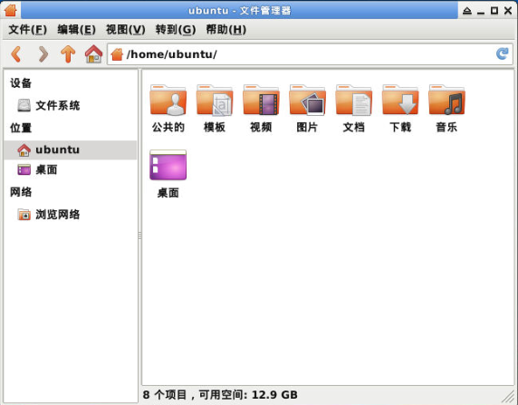
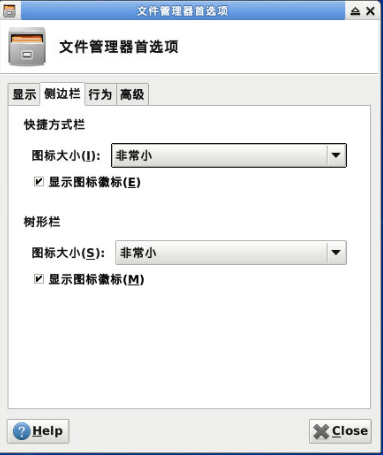
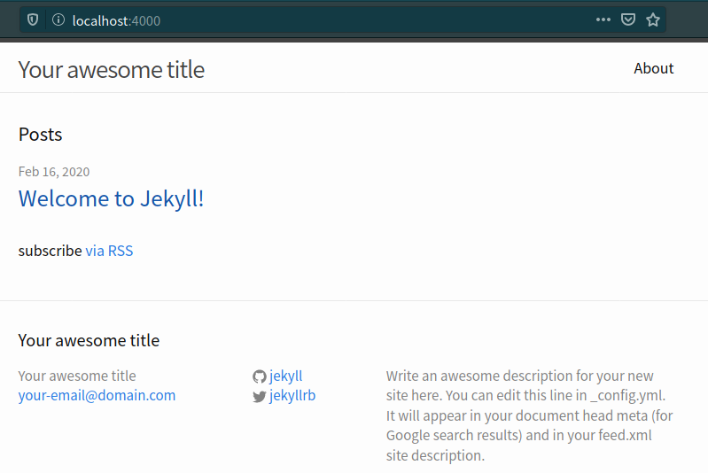

# 个性化配置与建站体验

!!! Failure "本文目前尚未完稿，存在诸多未尽章节且未经审阅，不是正式版本。"

!!! abstract "导言"

	Linux 是一个可以高度个性化定制的系统，当然也包括界面的个性化，因此本章节将带大家解决这些问题：
	
	* 如何选择并安装桌面环境
	* 如何打造自己独特的桌面
	* 如何配置美化命令行终端
	* 如何简单快速地搭建网站

## 命令行操作 

## 桌面环境 {# desktop-environment}

早期的 Linux 是不带图形界面的，只能通过命令行管理。随着时代的发展，人们不再满足于黑底白字的命令行界面，开发出来了 Linux 图形环境。
Linux 中的桌面环境也是一个程序，它和内核不是绑定的，两者的开发也不是同步的；给不带界面的 Linux 系统安装上一个桌面环境，你就能看到各种漂亮的窗口，并能用鼠标点击它们了。

### Xfce {# Xfce}

Xfce 是一款快速、轻量，界面美观和对用户友好的桌面环境。

本次所用的系统预先安装了 Xfce 桌面环境，因此本章将主要围绕 Xfce 的个性化来开展。实际上无论是哪一款桌面系统，个性化方式大同小异。

###  常用外观个性化 {# appearance-settings}

跟 Windows 系统一样，大部分 Linux 桌面环境个性化功能并不比 Windows 差。

我们直接打开 Xfce 中的设置管理器，如图所示。


图 1. 设置管理器的位置
{: .caption }

这里最常见的设置，都可以找得到。


图 2. 设置管理器
{: .caption }

#### 桌面 {# desktop}

xfdesktop 桌面管理器是 Xfce 中的一个主要模块，它负责在桌面上设置背景图像/颜色和绘制图标。当您分别用鼠标右键或鼠标中键单击桌面时，它可以显示应用程序菜单和所有正在运行的应用程序的列表。

##### 背景 {# desktop-background}


图 3. 桌面背景首选项
{: .caption }

背景设置是对壁纸的更改和个性化。

下表是一些配置的补充说明。

| 字段     | 功能                                                         |
| -------- | ------------------------------------------------------------ |
| 目录     | 存放壁纸的目录，默认文件夹是在`/usr/share/backgrounds/xfce/`。 |
| 样式     | 壁纸的显示样式、包括居中、平铺等。                           |
| 颜色     | 用于填充背景空缺部分的颜色，可以设置纯色、渐变、透明。       |
| 修改背景 | 如果一个位置包含多张图像，则 Xfce 允许您通过循环浏览可用图像来自动更改背景。您可以通过选中**更改背景**框来启用此选项。 |

##### 菜单 {# desktop-menus}


图 4. 桌面菜单首选项
{: .caption }

Xfce 允许用户自定义右键菜单和中键菜单的行为。这里可以对在桌面右键和中键的菜单进行设置。

若「在桌面上右击时包含应用程序菜单」选项被选中，则在桌面右键时会显示下面的菜单，用于快速打开应用程序。


图 5. 桌面应用程序菜单
{: .caption }

若「在桌面上中击时显示窗口列表菜单」选项被选中时，中击桌面可以弹出工作区的菜单，可以显示所有工作区正在运行的应用程序。


图 6. 桌面工作区菜单
{: .caption }

##### 图标 {# desktop-icons}


图 7. 桌面图标首选项
{: .caption }

Xfce 允许用户绘制桌面图标并且设置其外观。

在图标类型项，你可以下拉菜单选择「无」来选择具有无图标的桌面，或者选择「文件/启动器图标」来选择有图标的桌面。若选择了「已最小化应用程序的图标」，桌面就会把最小化的程序变成桌面上的图标。

#### 外观 {# appearance}

##### 样式 {# appearance-styles}


图 8. 外观样式首选项
{: .caption }

这些就是 Xfce 的样式，这些样式可以控制控件（如按钮和菜单）的外观，直接在列表中选择即可切换样式。

!!! tip "提示"

	除了列表中已有的样式，我们可以自己下载更多更炫酷的样式。我们将在扩展内容中提及具体操作方法。

##### 图标 {# appearance-icons}


图 9. 外观图标首选项
{: .caption }

这个列表控制图标的视觉外观，这些图标将会被显示在面板上，桌面上，文件管理器和菜单中。

!!! tip "提示"

	同样式一样，我们也可以自己下载安装图标。我们将在扩展内容中提及具体操作方法。

##### 字体 {# appearance-fonts}


图 10. 外观字体首选项
{: .caption }

在「默认字体」和「默认等宽字体」中下拉菜单可以选择字体的 Family, Style 和 Size .

「启动抗锯齿」选项可消除锯齿字体，使字符具有平滑的边缘。

「提示」是一种字体渲染技术，可提高小尺寸和低屏幕分辨率时的字体质量。选择一个选项以指定如何应用提示字体。

#### 窗口管理器 {# WM}

xfwm4 窗口管理器也是 Xfce 桌面环境的核心模块。窗口管理器负责窗口在屏幕上的放置，提供窗口装饰，并允许它们移动，调整大小或关闭。

##### 样式 {# WM-styles}


图 11. 窗口管理器样式首选项
{: .caption }

Xfce 允许用户自定义窗口的样式，「样式」对话框是用来控制窗口本身的，包括窗口的主题、标题和布局。

##### 键盘 {# WM-keyboard}


图 12. 窗口管理器键盘首选项
{: .caption }

在「键盘」对话框，我们可以双击列表中的动作选项来设置或更改快捷键。

#### 面板 {# panels}

Xfce-panel 也是 Xfce 的核心模块，具有应用程序启动器，面板菜单，工作区切换器等功能。


图 13. 默认的顶部面板
{: .caption }

##### 显示 {# panels-display}


图 14. 面板显示首选项
{: .caption }

面板选项的顶部可以选择要控制的面板对象。下拉选单我们可以发现，默认的「面板2」是底部显示应用程序的 Dock。我们可以轻松得添加、删除面板（理论上可以添加无数个面板，取决与你的喜好）。

在「显示」选项卡中，我们可以修改面板的「模式」，可以使将面板设置为水平或者垂直于桌面栏。

「锁定面板」选项选中后，面板将不能被鼠标拖拽移动。

「自动隐藏」当设置为「聪明地」时，会在聚焦的窗口与面板重叠时隐藏面板。

下方的尺寸栏允许我们轻易地改变面板的尺寸。

##### 项目 {# panels-items}


图 15. 面板项目首选项
{: .caption }

项目 (Items) 是一项非常实用的功能，实际上就是小部件，不仅可以在面板中显示内部信息（如窗口、工作区、邮件等），还可以显示外部硬件信息（如 CPU, 磁盘等）。我们可以在「项目」选项卡中管理它们。 另外我们也可以直接在对应的面板直接右键添加项目。

### 常用功能个性化 {# basic-settings}

#### 文件管理器 {# FM}

文件管理器是 Linux 桌面环境重要的模块之一。

*Thunar* 是 Xfce 桌面环境的现代文件管理器。*Thunar* 从一开始就被设计为快速且易于使用。它的用户界面干净直观，默认情况下不包含任何令人困惑或无用的选项。*Thunar* 可以快速启动，并且浏览文件和文件夹的过程非常快速且响应迅速。

##### 布局 {# FM-layout}



图 16. 文件管理器
{: .caption }

左边的侧边栏主要显示三类对象：设备、位置和网络。我们可以通过上方菜单栏的`视图-侧边栏`选择侧边栏显示方式是「快捷方式」或者是「树形」。通过直接右键侧边栏的空白处也可有隐藏不想显示的设备、位置或是网络中的东西。

菜单栏下方的地址栏显示目前的目录地址，可以通过菜单栏「视图」 ->「位置选择器」选择「工具栏样式」或者是路径栏样式。	

如果不喜欢主界面的图标显示，我们还可以选择「视图」-> 「以详细列表查看来以列表显示」。在列表显示的时候，我们可以通过「视图」 -> 「配置栏」管理列表显示的属性。


图 17. 文件管理器列表显示
{: .caption }

还有更多可以配置的选项，可以在「编辑」-> 「首选项」中配置。



图 18. 文件管理器首选项
{: .caption }

##### 插件 {# FM-plugins}

Thunar 提供了一套插件接口，Thunar 插件可以作为单独的软件包安装。详细按照方式将在拓展资料讲解。

#### 会话管理器 {# sessions}

*Xfce4-session* 是 Xfce 的会话管理器。它的任务是保存桌面的状态（打开的应用程序及其位置），并在下次启动时将其还原。您可以创建几个不同的会话，并在启动时选择其中一个。

在「设置管理器」的「会话和启动」中可以配置它。


图 19. 会话与启动
{: .caption }

##### 应用程序自启动 {# autostart}


图 20. 自启动首选项
{: .caption }

在这个列表中我们可以轻松管理自启动执行的程序。

## 搭建简易的网站

Linux 环境中较 Windows 更加容易搭建，仅需一两行命令，即可搭建成型的网站。

### WordPress

WordPress 是一个以 PHP 和 MySQL 为平台的自由开源的博客软件和内容管理系统。下面我们直接安装

```shell
$ sudo apt install wordpress 
```
这样就已经把 WordPress 所依赖的环境搭建好了，我们只需要稍微配置一下它。

创建一个 `/etc/apache2/sites-available/wordpress.conf` 文件，把下面内容填入

```
Alias /blog /usr/share/wordpress
<Directory /usr/share/wordpress>
    Options FollowSymLinks
    AllowOverride Limit Options FileInfo
    DirectoryIndex index.php
    Order allow,deny
    Allow from all
</Directory>
<Directory /usr/share/wordpress/wp-content>
    Options FollowSymLinks
    Order allow,deny
    Allow from all
</Directory>
```

保存后输入命令来重启 apache2

```shell
$ sudo a2ensite wordpress
$ sudo a2enmod rewrite
$ sudo service apache2 reload
```

再配置数据库相关内容

```shell
$ sudo mysql -u root
```
出现以下信息时

```text
Welcome to the MySQL monitor.  Commands end with ; or \g.
Your MySQL connection id is 2
Server version: 5.7.29-0ubuntu0.18.04.1 (Ubuntu)
Copyright (c) 2000, 2020, Oracle and/or its affiliates. All rights reserved.
Oracle is a registered trademark of Oracle Corporation and/or its affiliates. Other names may be trademarks of their respective owners.
Type 'help;' or '\h' for help. Type '\c' to clear the current input statement.
```

参照下面的命令，输入，其中 `<your-password>` 替换为你自己设定的密码

```mysql
mysql> CREATE DATABASE wordpress;
mysql> GRANT SELECT,INSERT,UPDATE,DELETE,CREATE,DROP,ALTER
    -> ON wordpress.*
    -> TO wordpress@localhost
    -> IDENTIFIED BY '<your-password>';
mysql> FLUSH PRIVILEGES;
```

这里每次执行成功都会得到

```text
Query OK, 1 row affected (0,00 sec)
```

退出

```mysql
mysql> quit
```

编辑我们的 WordPress 配置 `/etc/wordpress/config-localhost.php`

写入以下内容，其中 `<your-password>` 为刚才设定的数据库密码。

```php
<?php
define('DB_NAME', 'wordpress');
define('DB_USER', 'wordpress');
define('DB_PASSWORD', '<your-password>');
define('DB_HOST', 'localhost');
define('DB_COLLATE', 'utf8_general_ci');
define('WP_CONTENT_DIR', '/usr/share/wordpress/wp-content');
?>
```

最后输入

```shell
$ sudo service mysql start
```

启动 mysql 数据库，即可在浏览器输入地址

```text
http://localhost/blog
```

来完成安装。


### Jekyll

Jekyll 是一个将纯文本转化为静态博客和网站的工具。我们只需要安装它。

```shell
$ apt install jekyll
```

再输入几行命令用于创建网站

```shell
~ $ jekyll new my-awesome-site
~ $ cd my-awesome-site
~/my-awesome-site $ jekyll serve
```

打开浏览器，在浏览器中输入 并打开

```text
http://localhost:4000
```

即可打开我们搭建的网站。



## 思考题
## 引用来源