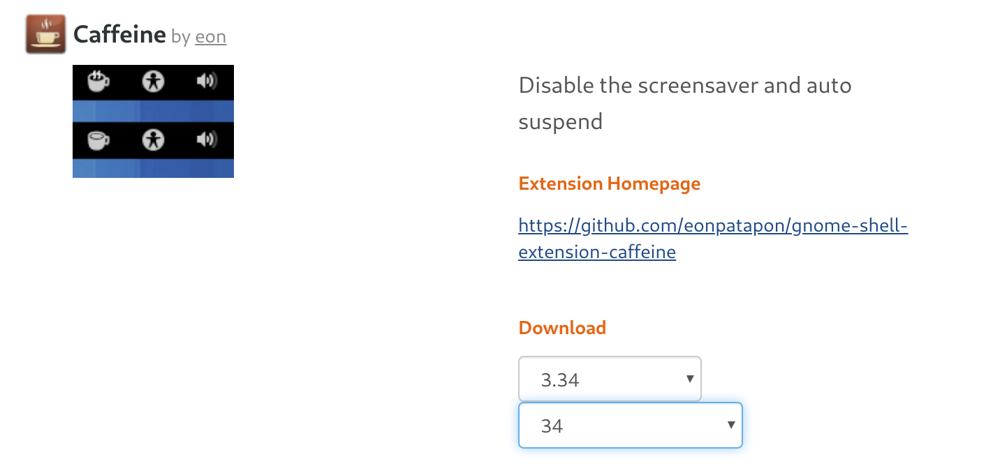
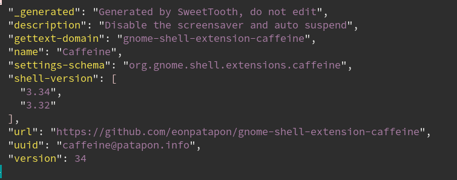
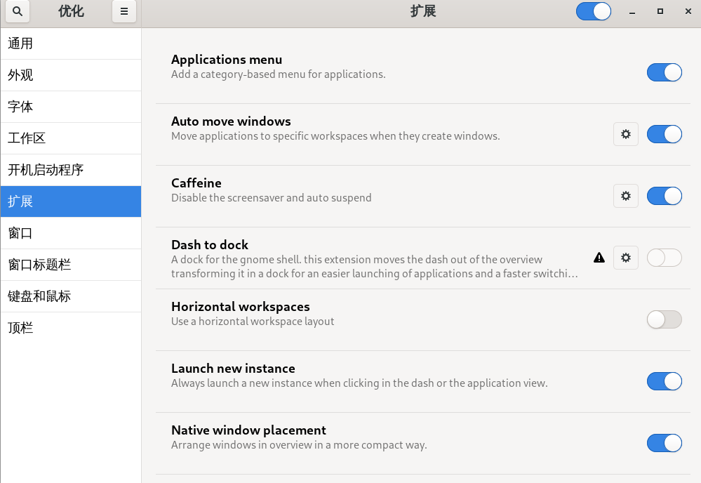
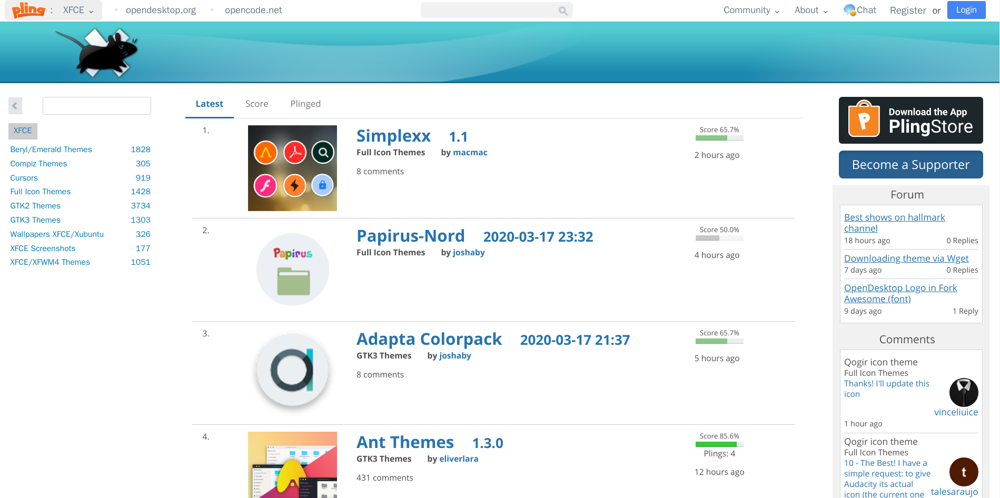
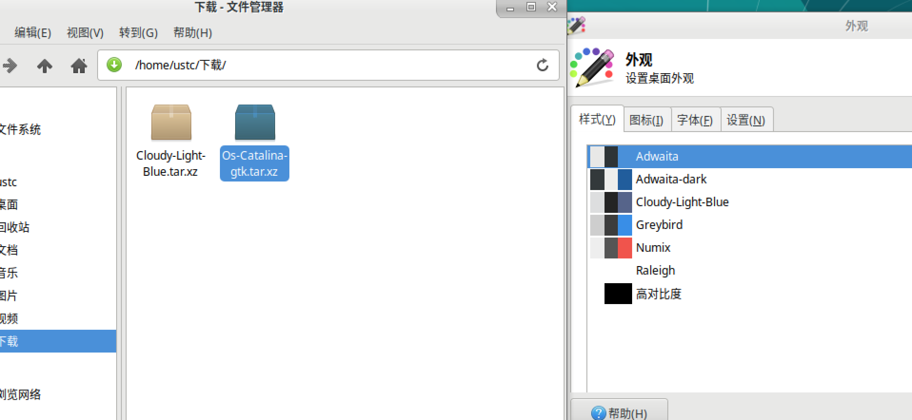
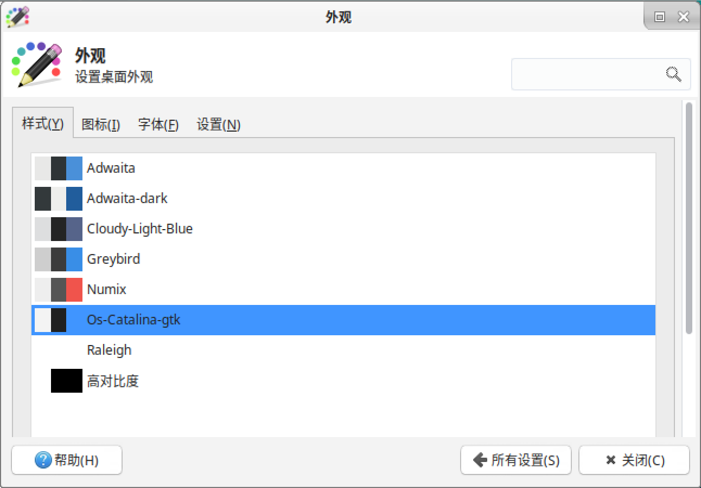

# 拓展阅读

!!! Failure "本文目前尚未完稿，存在诸多未尽章节且未经审阅，不是正式版本。"

## 桌面环境的安装 {#desktop-install}

如果你安装的系统没有预装桌面环境，或者你想要更换其他桌面环境，我们就需要自己安装桌面环境。

下面就来介绍如何手动安装桌面环境。

以在 Ubuntu Server 18.04.3 (未包含图形环境的系统) 上安装桌面环境为例。只需要执行以下步骤：

安装 `ubuntu-gnome-desktop` 软件：

```shell
$ sudo apt install ubuntu-gnome-desktop
```

接下来的提示中按输入 Y 回车即安装。

!!! tip "注意"

    若安装非常缓慢，可以尝试更换国内的软件源。[科大源更换教程](https://mirrors.ustc.edu.cn/help/ubuntu.html)

安装完成后输入：

```shell
$ sudo reboot
```

重启后可以看到，GNOME 桌面已经安装完成。我们拥有了图形界面。


可以看到，通过简单几步，我们的桌面环境就安装成功了。

??? example "安装 Plasma 桌面"

    同理，如果你喜欢 KDE plasma 桌面，只需要执行

    ```shell
    $ sudo apt install kde-plasma-desktop
    $ sudo reboot
    ```

## GNOME 相关

### GNOME 桌面环境的个性化 {#gnome-personalization}

大部分桌面环境都支持主题的个性化。例如：窗口样式，按钮样式，Dock 样式，指针样式等等。

在 GNOME 桌面下用户可以轻松更换主题。
首先安装 `gnome-tweaks` 软件：

```shell
$ sudo apt install gnome-tweaks
```

在 [GNOME Look](https://www.gnome-look.org/) 中找到自己喜欢的主题。

!!! info "注意"

    不同类型的主题有不同的安装方法，一般在主题介绍页面有显示。

点击 Download 下载一个压缩包：


解压后放到 `~/.themes` 文件夹，若不存在该文件夹则创建一个。

```shell
$ mkdir ~/.themes
```

!!! tip "家目录与隐藏文件"

    `~` 是用来简单表示用户的家目录（主目录）的符号，普通用户的家目录一般位于 `/home/用户名/`。`~/.themes` 即代表家目录下的 `.themes` 文件夹。

    以 `.` 开头的文件和文件夹是隐藏的。如果使用图形界面解压缩，有可能看不到 `.themes` 目录。此时可以按下 Ctrl + H 快捷键显示隐藏文件夹。

输入：

```shell
$ gnome-tweaks
```

打开 gnome-tweaks，在外观选项中选中想要的主题。

重启 GNOME 即可完成主题更换。

!!! tip "提示"

    你也可以使用 ocs-url 软件，在网页中直接安装主题，参考本章附录

如果你觉得商店中的主题不符合你的审美，你也可以自己制作一款独一无二的主题，或者直接修改现有的主题。

#### GNOME 的 Shell 扩展 {#gnome-extensions}

GNOME 支持很多扩展，并且有一个专门用于扩展的网站。https://extensions.gnome.org/

要使用 GNOME 扩展，我们要先安装 `gnome-shell-extensions`。

```shell
$ sudo apt install gnome-shell-extensions
```

接下来进入扩展插件的网站并选择其中一款扩展。



Caffeine 是一款可以允许用户在开关时保持其计算机屏幕不会自动暂停的插件。

我们可以输入：

```shell
$ gnome-shell --version
```

查看版本。

在插件网页中下载对应版本的压缩包。并解压到一个文件夹里。

这时我们打开文件夹里的 `metadata.json` 文件。

将文件夹的名字改为 `metadata.json` 中的 UUID：



UUID 为 "caffeine@patapon.info"


并将该文件夹放到 `~/.local/share/gnome-shell/extensions/` 中。

打开 `gnome-tweaks`。

```shell
$ gnome-tweaks
```

在扩展一栏即可启用我们刚刚装的 caffeine。



!!! tip "提示"

    手动安装显然过于复杂，我们完全可以只使用浏览器来完成扩展插件的管理和安装。

    首先安装浏览器插件：

    对于 Google Chrome、Chromium 和 Vivaldi：[Chrome Web 商店](https://chrome.google.com/webstore/detail/gnome-shell-integration/gphhapmejobijbbhgpjhcjognlahblep)

    对于 Firefox： [Mozilla Addons](https://addons.mozilla.org/en-US/firefox/addon/gnome-shell-integration/)

    再安装本地连接器：

    ```shell
    $ sudo apt install chrome-gnome-shell
    ```

    即可在 https://extensions.gnome.org/ 网页中管理、安装插件。

    

## Xfce 联网下载安装更多主题 {#xfce-themes}

除了系统自带的外观样式和图标外，网络上有更多的主题提供下载。例如在 [Xfce-look](https://www.xfce-look.org/) 上，就有上万个不同类型的主题。安装方法也十分简单。



我们可以选中任意一款主题。我们以下面这个为例。


点击 Download 按钮下载它，一般会得到压缩包格式的文件。我们打开设置管理器中的「外观」首选项，把下载好的压缩包文件直接拖拽到样式列表中。



选中刚刚拖拽进去的主题即可更换。



!!! tip "提示"

    有些主题包是很多样式（包括窗口、图标和外观样式）成套出现的，如果安装的主题包括了 Xfwm4 窗口管理器主题的话，我们会发现在「窗口管理器」首选项中，该主题也会出现：

    

    选中后，窗口样式就变了。

更换主题包后，是不是整个系统变得高大上了起来？

!!! tip "提示"

    我们可以安装插件在网页上直接安装主题。

    在 <https://www.pling.com/p/1136805/> 中，下载 ocs-url，下载时选择 deb 后缀的安装包。

    

    命令行进入下载好的安装包所在文件夹，输入以下命令。注意替换「下载的包」为你的安装包名，例如如果下载的安装包名为 `ocs-url_3.1.0-0ubuntu1_amd64.deb`，则 `install` 后面的参数为 `./ocs-url_3.1.0-0ubuntu1_amd64.deb`。

    ```shell
    $ sudo apt install ./下载的包.deb
    ```

    即可完成安装。

    接下来在 <https://www.xfce-look.org/> 中所有的主题只需要点击 Install 即可自动安装到相应的目录。你只需要在 gnome-tweaks 中更换主题即可。

## 终端的个性化 {#terminal-personalization}

使用 Linux 系统时，不可避免接触终端命令行操作，但是默认的终端黑底白字。有什么办法可以既美化终端，又提高工作效率呢？下面我们介绍一些美化终端的方法。

### 更换 Shell {#chsh}

在此之前我们可以通过：

```shell
$ echo $SHELL
```

检查目前我们正在用的是什么 Shell。Ubuntu 默认使用 Bash，在这里推荐一个更加强大的 Shell 工具——Z shell（Zsh）。

#### Zsh

首先通过 apt 安装 `zsh`：

```shell
$ sudo apt install zsh
```

将 zsh 设定为默认 shell：

```shell
$ chsh -s /bin/zsh
```

重启后打开终端就会发现 shell 已经变成了 zsh。

第一次打开 zsh 会有首次使用提示，这里我们按 0 跳过。

接下来的提示中按 Y 回车即安装。

然而这时的 zsh 仍然是黑底白字，要让它变好看，我们需要对 zsh 进行配置。

##### oh-my-zsh

oh-my-zsh 是一个管理 zsh 配置的框架，评价也非常好。

```shell
$ sh -c "$(curl -fsSL https://raw.githubusercontent.com/ohmyzsh/ohmyzsh/master/tools/install.sh)"
```

!!! info "如果无法下载安装脚本"

    如果遇到了网络连通性问题，可以使用以下替换命令：

    ```shell
    $ sh -c "$(curl -fsSL https://cdn.jsdelivr.net/gh/ohmyzsh/ohmyzsh@master/tools/install.sh)"
    ```

安装完成后就可以看到 shell 不再是黑底白字，让人感到焕然一新，然而也许这样并不能让你满足。

我们可以修改 `~/.zshrc` 里的这一行中的引号部分切换主题：

    ZSH_THEME="robbyrussell"

如果只想试用某个主题，可以使用以下命令：

    omz theme use robbyrussell

来临时试用某主题。
具体主题可以在 [oh-my-zsh 的项目 Wiki](https://github.com/ohmyzsh/ohmyzsh/wiki/Themes) 中找到。
当然你也可以尝试自己做一个主题。

## 其它的个性化 {#other-personalizations}

上面内容都是外观上的个性化，更多地，Linux 系统的可客制化还体现在一些配置文件上。

### etc 目录

`/etc` 目录是包含几乎所有 Linux 系统配置的一个文件夹。

!!! info "tips"

    etc 是 "et cetera" 的简称，意思是 "and so on"，在 Unix 初期人们实现 `etc` 文件夹就是为了保留配置文件，数据文件，套接字文件或其他文件用的。随着时间流逝，文件夹的含义已经更改，但是名字 etc 没有更改。现在 `/etc` 目录是所有配置文件的集中地，可以看作 Linux 系统的神经中枢。

下面介绍几个常用的配置文件：

- `/etc/fstab` 系统磁盘挂载相关配置；
- `/etc/bash.bashrc` 启动 Bash 时读取的配置脚本；
- `/etc/sudoers` sudo 权限的配置；
- `/etc/hosts` 主机名与 IP 映射关系的配置。

??? example "示例"

    当我们登录用户成功时：

    ```shell
    $ sudo login
    ```

    会提示以下信息：

    ```text
    Welcome to Ubuntu 18.04.3 LTS (GNU/Linux 5.3.0-28-generic x86_64)
     * Documentation:  https://help.ubuntu.com
     * Management:     https://landscape.canonical.com
     * Support:        https://ubuntu.com/advantage
     * Canonical Livepatch is available for installation.
       - Reduce system reboots and improve kernel security. Activate at:
         https://ubuntu.com/livepatch
    125 个可升级软件包。
    0 个安全更新。
    Your Hardware Enablement Stack (HWE) is supported until April 2023.
    *** 需要重启系统 ***
    The programs included with the Ubuntu system are free software;
    the exact distribution terms for each program are described in the
    individual files in /usr/share/doc/*/copyright.

    Ubuntu comes with ABSOLUTELY NO WARRANTY, to the extent permitted by
    applicable law.
    ```

    Ubuntu 下这些提示信息都可以在 `/etc/update-motd.d/` 目录下修改, 登录后，将会在该目录依数字递增顺序执行该目录下的脚本。

    !!! info "提示"

    	有的 Linux 发行版的 MOTD (Message Of The Day) 配置在 `/etc/motd`

    我们在 `/etc/update-motd.d/` 目录下新建一个文件 `99-test`，写入下面内容：

    ```shell
    #!/bin/sh
    echo helloworld
    ```

    然后：

    ```shell
    $ sudo chmod +x /etc/update-motd.d/99-test
    ```

    设置好权限，登录后就可以看到在末尾加上了我们在 `99-test` 文件中 echo 的内容。

    当然如果你不希望显示上面的更新提示内容，也可以直接找到对应的文件删除或修改。

## 搭建简易的网站 {#website}

### WordPress 的手动配置

```shell
$ sudo apt install -y wordpress php libapache2-mod-php mysql-server php-mysql
```

这样就已经把 WordPress 所依赖的环境搭建好了，我们只需要稍微配置一下它。

创建一个 `/etc/apache2/sites-available/wordpress.conf` 文件，填入下面内容：

```apache
Alias /blog /usr/share/wordpress
<Directory /usr/share/wordpress>
    Options FollowSymLinks
    AllowOverride Limit Options FileInfo
    DirectoryIndex index.php
    Order allow,deny
    Allow from all
</Directory>
<Directory /usr/share/wordpress/wp-content>
    Options FollowSymLinks
    Order allow,deny
    Allow from all
</Directory>
```

保存后输入命令来重启 `apache2`：

```shell
$ sudo a2ensite wordpress
$ sudo a2enmod rewrite
$ sudo service apache2 reload
```

再配置数据库相关内容：

```shell
$ sudo mysql -u root
```

出现以下信息时：

```text
Welcome to the MySQL monitor.  Commands end with ; or \g.
Your MySQL connection id is 2
Server version: 5.7.29-0ubuntu0.18.04.1 (Ubuntu)
Copyright (c) 2000, 2020, Oracle and/or its affiliates. All rights reserved.
Oracle is a registered trademark of Oracle Corporation and/or its affiliates. Other names may be trademarks of their respective owners.
Type 'help;' or '\h' for help. Type '\c' to clear the current input statement.
```

Ubuntu 18.04 默认安装的是 MySQL 5.7。参照下面的命令，输入，其中 `<your-password>` 替换为你自己设定的密码：

```mysql
mysql> CREATE DATABASE wordpress;
mysql> GRANT SELECT,INSERT,UPDATE,DELETE,CREATE,DROP,ALTER
    -> ON wordpress.*
    -> TO wordpress@localhost
    -> IDENTIFIED BY '<your-password>';
mysql> FLUSH PRIVILEGES;
```

Ubuntu 20.04 默认安装的是 MySQL 8.0。由于其不再支持使用 `GRANT` 直接创建用户，命令需要小幅修改：

```mysql
mysql> CREATE DATABASE wordpress;
mysql> CREATE USER wordpress@localhost IDENTIFIED BY '<your-password>';
mysql> GRANT SELECT,INSERT,UPDATE,DELETE,CREATE,DROP,ALTER
    -> ON wordpress.*
    -> TO wordpress@localhost;
mysql> FLUSH PRIVILEGES;
```

这里每次执行成功都会得到：

```text
Query OK, 1 row affected (0,00 sec)
```

退出 MySQL 命令行：

```mysql
mysql> quit
```

编辑我们的 WordPress 配置 `/etc/wordpress/config-localhost.php`

写入以下内容，其中 `<your-password>` 为刚才设定的数据库密码。

```php
<?php
define('DB_NAME', 'wordpress');
define('DB_USER', 'wordpress');
define('DB_PASSWORD', '<your-password>');
define('DB_HOST', 'localhost');
define('DB_COLLATE', 'utf8mb4_general_ci');
define('WP_CONTENT_DIR', '/usr/share/wordpress/wp-content');
?>
```

然后输入：

```shell
$ sudo service mysql start
```

启动数据库。

最后我们打开浏览器并进入 `localhost/blog` 来完成最后的配置。

## 引用来源 {#references .no-underline}

- [How to install themes with GNOME tweak tool? - Ask Ubuntu](https://askubuntu.com/a/1128098/612877)
