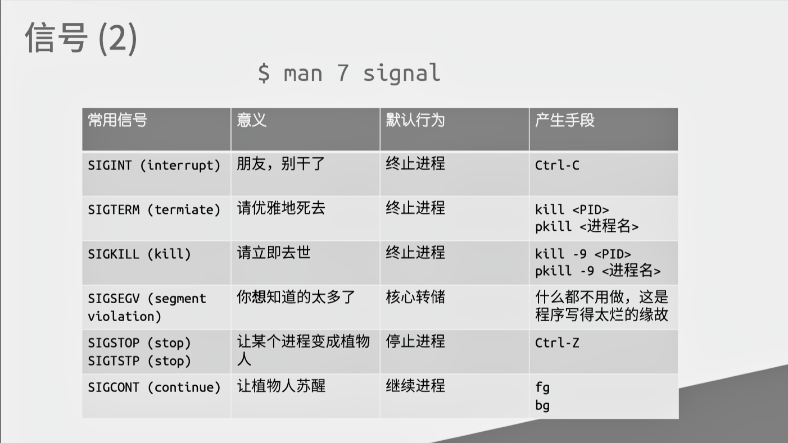

#进程、前后台、服务与例行性任务

对于第一遍阅读，建议<a href="javascript:void(0)" onclick='$(".more").hide(); $("details[open] summary").click(); $("//a[href=\\.\\.\\/1-supplement\\/]").hide()'>隐藏细节</a>/<a href="javascript:void(0)" onclick='$(".more").show(); $("details:not([open]) summary").click(); $("//a[href=\\.\\.\\/1-supplement\\/]").show()'>显示细节</a>

本节内容将不可避免遇到以下名词：操作系统，内核（kernel），shell...建议阅读intro文档后浏览本章内容。

!!! abstract "摘要" 
    进入Linux的世界，便意味着与系统管理直接打交道，无法像windows一样独善其身。系统正在做什么？我们如何给系统安排任务？本章将要带大家走进进程，进而实现Linux更高级的自动化。
        
    1. 进程初探
        * 进程存在意义，基本属性（出现在htop上的条目），进程间通信方式。
        <p class="more">*Linux进程调度策略简述（增加内核书目链接以及torvalds/linux目录）    </p>
    2. htop的使用（在进程调度方面的应用）
        * 进程间关系演示（进程树），信号传输实现（trap）<杀死几乎所有进程会如何 kill -9 -1>
        <p class="more">*htop的其他选项（查看文件描述符），从而理解一些特殊文件的存在（如0号stdin，1号stdout，2号stderr）</p>
    3. 将无需交互的程序放入后台
        * ctrl + Z挂起，bg与fg，nohup过继进程
    4. 守护进程与服务
        * 守护进程的工作模式，htop中守护进程的举例。
        * *配置ssh服务演示
    5. 例行性任务设置
        * 定时任务，比如定时upgrade。


<p class="more">用来激活正文的html代码提示，编写完成即删去</p>


##进程
**现在设想你有一堆任务在一周之内完成，应该如何下手呢？**

一些情况下，我们或许会随机选择一个做，但也许拿出日历，根据轻重缓急排出一个先后来更为合适。计算机同样面临着繁多的事务，CPU的时间也同样需要被安排。

**那么在计算机中，操作系统又是如何实现各项工作的安排呢？**

!!! tip "管理工作需求的产生"
    在最早期的晶体管计算机时代<ref>，没有操作系统，由操作员负责输入输出，意味着处理单元的时间在等待IO的过程中浪费。可见，只有让任务之间衔接得足够快，才能更好地利用处理器性能。当时采用批处理策略集中任务，并由一个处理程序负责加载程序，录入数据，输出结果。这种按录入顺序装载程序并负责IO的处理工作的程序便成为操作系统的雏形。

在以上过程中，操作系统直接面临的就是一个个等待运行的任务，随后演变为**进程**。


??? info "任务（task）与进程（process）"
    事实上，任务只是那么一段需要运行的代码（重点强调完成一件事），而进程是一个任务管理意义上的实体，不仅包括代码，还有自己的状态信息（下面介绍）。
    

**进程**是计算机系统三大抽象之一，操作系统秉承“为进程服务”的理念而设计。


程序由数据结构和算法构成，程序需要存储资源安身，需要计算资源运行。而一个程序占有资源并运行便成为了进程。程序希望有CPU运行它，希望它需要的数据唾手可得，希望输出的数据可以被正确及时地送达。早期的系统不需要操心进程运行的顺序。然而随着人们对计算机需求越来越高，操作系统除了为进程提供基础服务之外，更需要管理好进程所竞争的资源，甚至要为实时交互提供方案。

??? tip "需求推动操作系统的发展（一点题外话）"
    早期采用单道批处理策略的计算机如果有程序等待IO，处理器只能傻等。为了更高效地利用处理器，出现 **多道程序设计**方案，允许充分利用程序IO的时间；为了响应实时性要求，出现了**中断(interrupt)**概念<ref>，响应硬件软件中断执行任务的请求；为了实现多人共用，出现了**分时系统**概念，虽然最初是对用户的分时，但与现在对进程的分时一致······正是这些逐渐增长的需求确定了现代操作系统需要解决的问题。

**有了进程的抽象后，操作系统又将如何以进程为单位，协调并保证工作的顺利进行呢？**

（注：以下内容建议使用 `sudo apt install htop` 安装并运行htop，即时查看进程的各个属性。同时伴随htop的应用讲解）


<p align="center" style="font-size: 94%">htop 示例 | <abbr title="链接到htop主页"><a href="https://hisham.hm/htop/">htop HomePage➚</a></abbr></p>

###Process ID
首先，有区分才有管理。进程号（PID）作为进程的唯一标识，最左侧一列即为PID。当系统想要调度进程，或者用户想挂起，继续或终止进程时将使用PID作为索引。

_在图形界面上，直接单击绿色条内的 PID 栏，可以将进程顺序按照 PID 序列排列，再次点击为反向排序，同理可应用于其他列。_


**那么，PID又是如何产生的呢？**

很简单，使用一个变量做计数器从零开始增加就可以了。早期的Linux版本中，PID最大值为65535，即PID变量为C语言short类型。虽然有一些程序中途退出，但系统执着地按照计数变量加一的方式赋给进程PID。超过上限后会从用户进程pid最低值重新分配没有占用的进程号，直到全部占满。然而编者现在版本的内核该变量相当于int类型，所以进程号有时看起来会很大。

###进程父子关系

除了最开始的0号进程外，其他进程一定由另一个进程通过fork产生，显然产生进程的一方为父进程，被产生的是子进程。在Linux中，父进程可以等待子进程，接收子进程退出信号以及返回值。父子关系引出了两个特殊现象——父进程先去世和子进程先去世，产生”孤儿进程（orphan）和僵尸进程（zombie）现象。孤儿进程由操作系统回收，交给init领养（图形界面时有点不同）；而僵尸进程来自于退出状态名称（对应子进程结束而父进程未查看情况）；此时进程资源大部分已释放，但占用一个PID，并保存返回值。系统中大量僵尸进程的存在将导致无法创建进程。同时，进程也不能主动脱离父子关系（至少不能通过系统调用脱离）

_按F2，随后可以自主选择进程的属性列在面板上，以Parent PID为例（PPID），点击colomns，点击PPID，注意到下方提示 F5 add 添加到左侧，再依照下方提示调整顺序。如果有兴趣，可以顺便在PPID后顺序添加PGRP，TTY_NR，TPGID，SESSION列便于后续讲解。_

（F10被终端程序占用了怎么办？其实终端上的选项是可以用鼠标点击的，点一下`done`即可返回。）


??? tip "Linux进程启动顺序"
    按照PID排序时，我们可以观察系统启动的过程。Linux系统内核从引导程序接手控制权后，开始内核初始化，随后手撸**init_task**，初始化自己的PID为0。随后创建出1号进程（init or systemd
    ）衍生出用户空间的所有进程，创建2号进程ktheadd衍生出所有内核线程。随后0号进程成为调度进程，1号，2号并非特意预留，而是产生进程的自然顺序使然。
    
    _由于ktheadd运行于内核空间，故需按大写K（shift + k）显示内核进程后才能看到。然而无论如何也不可能在htop中看到0号进程本体，只能发现1号和2号进程的PPID是0。_


##用戶进程控制

控制进程首先要与进程对话，那么首先需要了解进程间通信机制。由于进程之间不共享内存空间，也就无法直接发送信息，必须要操作系统帮忙，于是信号机制就产生了。

###信号

“没有消息就是最好的消息”，如果进程突然接到信号，多半是废了。连我们发送信号的linux命令都叫`kill`，可见进程凶多吉少（大多数信号默认操作都是各种退出）。

那到底都有什么信号呢？emmm... `man 7 signal`？

可这实在是太长了，还是来一个简明实用的吧。那么，


<p align="center" style="font-size: 94%">（来自上一次Linux101——进程、服务、任务的slide截图）</p>

###前后台切换

上面的图片中，出现了`fg bg`和`ctrl + z`，涉及到shell中前后台的概念。


!!! info "SIGTERM、SIGKILL"
    root from bash：发送SIGTERM给PID为1234的进程。
    
    kill：发送系统调用告诉内核，把SIGTERM传给1234进程。
    
    内核（被调用唤醒）：发送SIGTERM？有权限吗？哦是root啊，那没问题。</br>（把1234进程的信号标志位设为15，留言：“上面下来通知，你可以滚蛋了，别忘了把自己堆栈收拾立正再走。”）
    
    （调度器轮到1234号进程）1234：呦，有信号来了，哦，是SIGTERM啊，但很遗憾，这个信号在我这里是忽略的。
    
    <-- 一会后 -->
    
    root：进程怎么还没结束？那只好SIGKILL了。
    
    kill：发送系统调用告诉内核，把SIGKILL传给1234进程。
    
    内核（被调用唤醒）：什么？发送SIGKILL？有权限吗？哦是root啊，那没问题，1234没有运行的机会了，我会亲自清理重置它的堆栈，删掉进程描述符，顺便告诉它爹这个不幸的消息。
    
（SIGTSTP、SIGSTOP也是一样的道理，前者可以由用户按ctrl+Z产生，程序可以见到，后者程序由操作系统强制挂起。）

##htop使用实例

!!! warning 
    以下命令请勿生产环境中使用。
    
        sudo kill -9 -1
    
其实kill命令在部分发行版上有约定，~~负数PID死全家~~，但`man kill`只介绍了`-1`参数。（负号还可以理解为参数选项）
简单介绍一下kill，在靶机上root执行kill -9 -1

##程序状态转换

###后台任务
除nohup外，bash及其他的shell还可以有内建命令完成脱离

!!! question "问题"
    上面的示例中，`ping` 命令一直在输出，严重影响命令的输入，应如何操作？（详见流的重定向）

##服务

##例行性任务


##下载链接
<div class="more">
*尚未commit

[《现代操作系统》](pdfs/现代操作系统.pdf)

[《linux内核设计与实现》](pdfs/linux内核设计与实现.pdf)

```bash
    git clone https://github.com/torvalds/linux  #linux内核源码
```
</div>
<script type="text/javascript" src="http://code.jquery.com/jquery-1.7.1.min.js"></script>