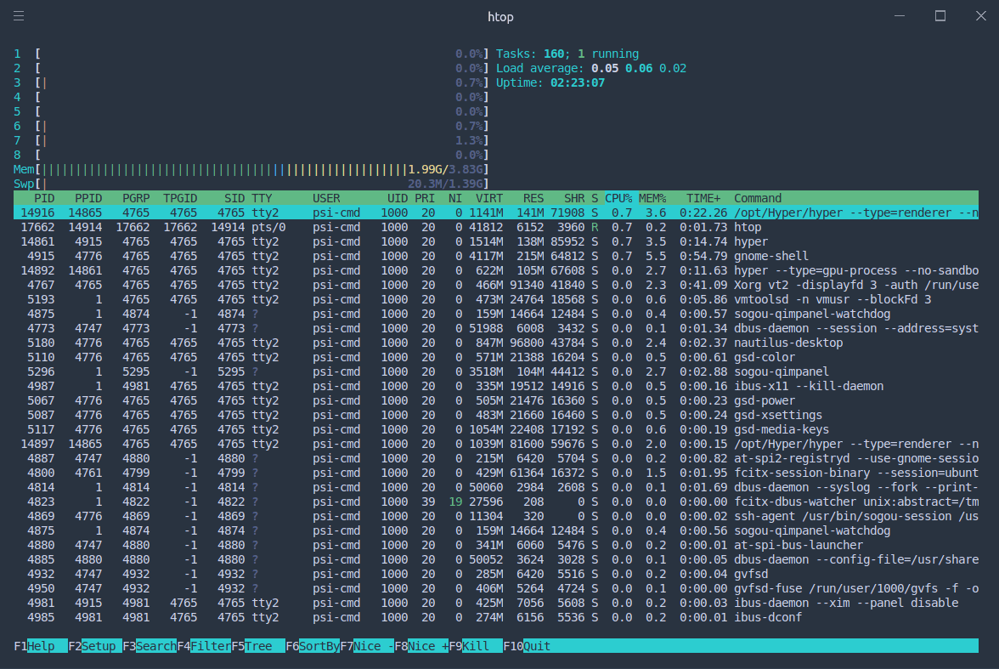
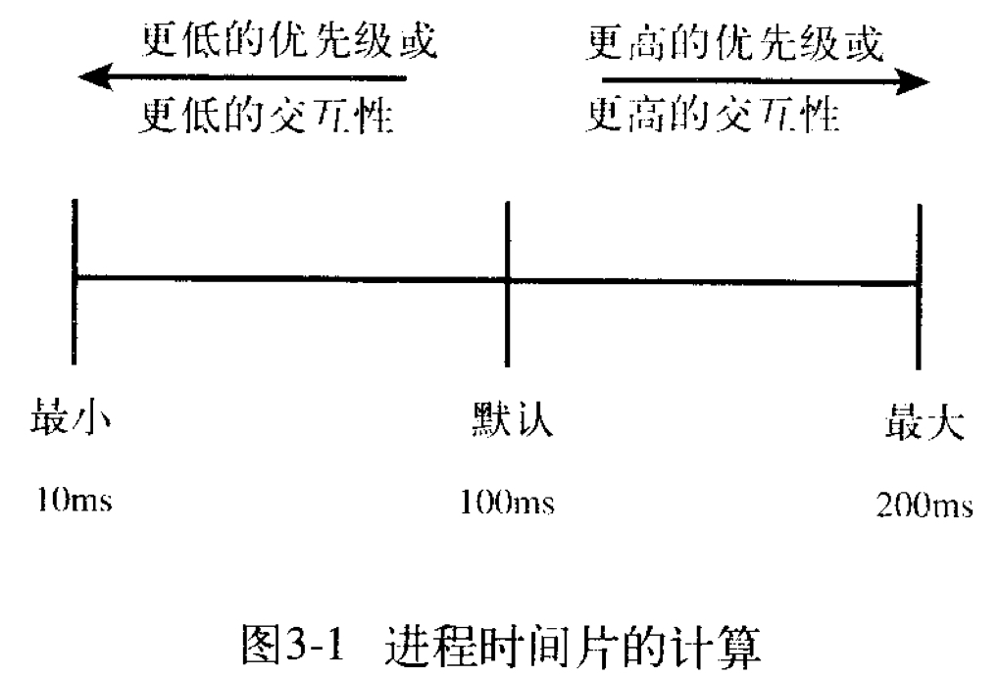
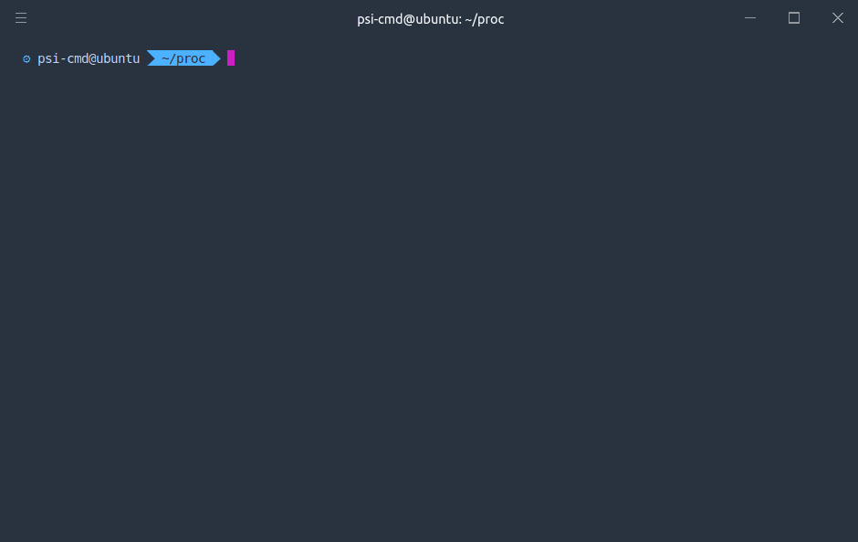
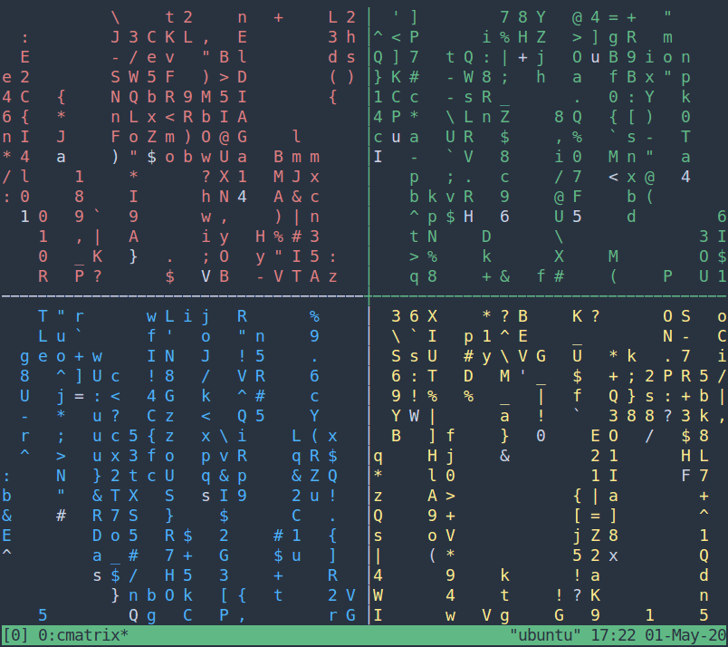

# 进程、前后台、服务与例行性任务

!!! warning "本文已基本完稿，正在审阅和修订中，不是正式版本。"

!!! abstract "摘要"

    进入 Linux 的世界，便意味着与系统管理直接打交道，无法像在 Windows 中一样独善其身。系统正在做什么？我们如何给系统安排任务？本章将要带大家走进进程，进而实现 Linux 更高级的自动化。

    其实应当坦言，对于许多仅仅是想应用 Linux 的同学而言，似乎系统层面的细节离自己需要的功能很远，不必加以理会。如果仅仅是以“个人使用”为目的，也许知道如何在程序失去响应时把它干掉就足够了。然而同学们有没有好奇过，我们为什么要装操作系统？重点是，为什么又装了一个 Linux 操作系统？简言之，操作系统可以帮程序“善后”，让程序过上“衣来伸手，饭来张口”的日子。而不同的操作系统会使用不同的策略和机制去提供相同的服务，策略机制的不同又体现着其服务理念的差异。当你大致了解 Linux 的机制时，“为什么”将自有答案。

    Linux 的特性，还需从操作系统管理进程的功能说起……

!!! info "本章阅读须知"

	本节内容将不可避免遇到以下名词：操作系统，内核 (kernel)，shell，中断，系统调用等等。建议先阅读本书[词汇表](../Appendix/glossary.md)，并在浏览本章内容时随时参考。

## 进程 {#process}

**现在设想你有一堆任务在一周之内完成，应该如何下手呢？**

一些情况下，我们或许会随机选择一个做，但也许拿出日历，根据轻重缓急排出一个先后来更为合适。计算机同样面临着繁多的事务，CPU 的时间也同样需要安排。

**那么在计算机中，操作系统又是如何实现各项工作的安排呢？**

在最早期的晶体管计算机时代，没有操作系统，由操作员负责输入输出 (I/O)，意味着处理单元的时间在等待 I/O 的过程中浪费。可见，只有让任务之间衔接得足够快，才能更好地利用处理器性能。当时采用批处理策略集中任务，并由一个处理程序负责加载程序，录入数据，输出结果。这种按录入顺序装载程序并负责 I/O 的处理工作的程序便成为操作系统的雏形。

在以上过程中，操作系统直接面临的就是一个个等待运行的任务，随后演变为**进程**。

程序需要存储资源安身，需要计算资源运行。而一个程序占有资源并运行便成为了进程。程序希望有 CPU 运行它，希望它需要的数据唾手可得，希望输出的数据可以被正确及时地送达。早期的系统不需要操心进程运行的顺序。然而随着人们对计算机需求越来越高，操作系统除了为进程提供基础服务之外，更需要管理好进程所竞争的资源，甚至要为实时交互提供方案。

??? tip "需求推动操作系统的发展"

    早期采用单道批处理策略的计算机如果有程序等待 I/O，处理器只能傻等。为了更高效地利用处理器，出现**多道程序设计**方案，允许充分利用程序 I/O 的时间；为了响应实时性要求，出现了**中断** (interrupt) 概念，响应硬件软件中断执行任务的请求；为了实现多人共用，出现了**分时系统**概念，虽然最初是对用户的分时，但与现在对进程的分时策略一致，正是这些逐渐增长的需求确定了现代操作系统需要解决的问题。

**有了进程的抽象后，操作系统又将如何以进程为单位，协调并保证工作的顺利进行呢？**

本节以下内容使用软件 htop 来讲解，建议在进一步阅读前使用 `sudo apt install htop` 安装并运行 htop，即时查看进程的各个属性。



htop 示例 | [htop 主页](https://hisham.hm/htop/)
{: .caption }

### 进程标识符 {#pid}

首先，有区分才有管理。**进程标识符** (PID, Process Identifier) 作为进程的唯一标识，便是身份证号一般的存在。在 htop 中，最左侧一列即为 PID。当系统想要调度进程，或者用户想挂起，继续或终止进程时将使用 PID 作为索引。

在 htop 中，直接单击绿色条内的 PID 栏，可以将进程顺序按照 PID 升序排列，再次点击为降序排列，同理可应用于其他列。


<!-- 感觉这里的解释太简单了，PID 分配的代码这里不仅仅是一个 counter 那么简单，它还有一个 bitmap 存储已经分配的 PID。先注释掉了。

??? tip "PID 是如何产生的"

    很简单，使用一个变量做计数器从零开始增加就可以了。早期的 Linux 版本中，PID 最大值为 32767。虽然有一些程序中途退出，但系统执着地按照计数变量加一的方式赋给进程 PID。超过上限后会从用户进程 PID 最低值重新分配没有占用的进程标识符，直到全部占满。然而编者现在版本的内核该变量相当于 int 类型，所以进程标识符有时看起来会很大。（[systemd NEWS](https://github.com/systemd/systemd/blob/224ded670feeb59f7231e6102a5bee5d3b653a8a/NEWS#L31)——systemd 官方消息，直接解释了 PID 的范围） -->

??? tip "Linux 进程启动顺序"

    按照 PID 排序时，我们可以观察系统启动的过程。Linux 系统内核从引导程序接手控制权后，开始内核初始化，随后变为 **init\_task**，初始化自己的 PID 为 0。随后创建出 1 号进程（init 程序，目前一般为 systemd）衍生出用户空间的所有进程，创建 2 号进程 ktheadd 衍生出所有内核线程。随后 0 号进程成为 idle 进程，1 号，2 号并非特意预留，而是产生进程的自然顺序使然。

    由于 ktheadd 运行于内核空间，故需按大写 K (Shift + K) 键显示内核进程后才能看到。然而无论如何也不可能在 htop 中看到 0 号进程本体，只能发现 1 号和 2 号进程的 PPID 是 0。

### 进程组织结构 {#process-struct}

#### 进程父子关系 {#parent-child}

除了最开始的 0 号进程外，其他进程一定由另一个进程通过 fork 产生，显然产生进程的一方为**父进程**，被产生的是**子进程**。在 Linux 中，父进程可以等待子进程，接收子进程退出信号以及返回值。

??? tip "孤儿进程 (orphan) 和僵尸进程 (zombie)"

    父子关系引出了两种特殊的运行情况——父进程先退出，它的子进程成为**孤儿进程** (orphan)；子进程先退出，而父进程未作出回应 (wait)，子进程则变为**僵尸进程** (zombie)。
    
    孤儿进程（即留下的子进程）由操作系统回收，交给 init「领养」。
    
    僵尸进程的进程资源大部分已释放，但占用一个 PID（上文已述，PID 个数有上限），并保存返回值。系统中大量僵尸进程的存在将导致无法创建进程。<!-- 同时，进程一般不能主动脱离父子关系（至少没有改变父子关系的系统调用），只能由于进程一方退出执行才会发生关系变动。-->

我们可以使用 htop 查看进程的父进程等信息。按 F2，随后可以自主选择进程的属性列在面板上，以 Parent PID 为例 (PPID)，点击 colomns，点击 PPID，注意到下方提示按 F5 可以添加到左侧，再依照下方提示调整顺序。同理可以顺便在 PPID 后顺序添加 PGRP，TTY\_NR，TPGID，SESSION 等列以便观察下面的实验结果。


如果 F10 被终端程序占用了，可以尝试用鼠标点击选项，或者修改终端程序的设置。例如，Xfce 默认的终端程序可以在 设置 => 高级 中取消对 F10 的占用。

#### 进程组 {#pgroup}

**进程组**大体上是执行同一工作的进程形成的一个团体，通常是由于父进程 fork 出子进程后子进程继承父进程的组 ID 而逐渐形成。设计进程组机制主要是为了面向协作任务，比如 Firefox 工作是网页浏览，那么其相关的进程一定属于一个进程组。进程组的出现方便了系统信号管理，后面可以看到，发给一个进程组的信号将被所有属于该组的进程接收，意义就是停止整个任务整体。

#### 会话——前台与后台 {#session}

而**会话** (session) 可以说是面向用户的登录出现的概念。当用户从终端登录进入 shell，就会以该 shell 为会话首进程展开本次会话。一个会话中通常包含着多个进程组，分别完成不同的工作。用户退出时，这个会话会结束，但有些进程仍然以该会话标识符 (session ID) 驻留系统中继续运行。

说到会话，就必然涉及到 Linux 会话中的前后台管理机制。**前台** (foreground) 与**后台** (background)，本质上决定了是否需要与用户交互，对于单独的一个 shell，只能有一个前台进程（组），其余进程只能在后台默默运行，上述中若干进程组，正是前台进程组和后台进程组的概称。在稍后部分中我们将学习前后台切换的相关操作。

### 进程调度 {#schedule}

#### 优先级与 nice 值 {#priority}

有了进程，谁先运行？谁给一点时间就够了，谁要占用大部分 CPU 时间？这又是如何决定的？这些问题之中体现着优先权的概念。如果说上面所介绍的的那些进程属性描述了进程的控制信息，那么**优先级** (priority, PRI) 与 **nice 值** (NI) 则反映操作系统调度进程的手段。

优先级思想很简单，为任务的重要程度排一个序。而 nice 值更加直白，数值越大，则说明这个程序越 "nice"——对其他的需要使用资源的程序友好。

内核以优先级为实际的指标来调度进程，而用户程序的优先级会根据它的 nice 值来计算。默认的 nice 值为 0。

??? info "协作与抢占"
    实际上，并不是所有的操作系统都去操这个心，有的操作系统从来不管 CPU 怎么用：只要程序不放弃 CPU，就可以一直运行下去。这种操作系统为**协作式** (cooperative) 操作系统，而这往往意味着操作系统中软件之间高度耦合，互相考虑。但我们日常中经常使用不同来源的软件，不可能为彼此考虑周全。为了保证这些软件之间资源分配的公平性，显然必须引入轮流调度算法，分配**时间片** (time slice)，让每个进程在一定时间内都得到运行。这种运行模式的操作系统便称为**抢占式** (preemptive) 操作系统。

??? info "中断与进程调度"

    系统进行调度，主要面临这样几个问题：

    - 何时（什么契机）可以进行调度？
    - 要不要进行调度切换进程？ 
    - 该调度谁？

    首先若想进行调度，必有[中断](../Appendix/glossary.md#irq)参与。简言之，中断即是为了能够让操作系统或是其他程序切入运行状态程序所提供的机制。而调度过程本身即是打断正在运行的程序，唤起另一个程序的过程。没有中断，操作系统都无法介入运行，如何切换进程？可见，操作系统必然在有中断时进行调度。那么现代操作系统如何利用中断进行调度呢？

    已知我们一需要轮流调度算法、二需要支持高优先级抢占低优先级与事件驱动，则系统必然需要在周期性的时钟中断到来时，重新执行一遍调度，查看当前进程的时间片是否使用完毕，以及是否有高优先级程序已经准备就绪。而为了达成事件驱动，系统在一些其他中断发生后，也需要进行例行调度检查，如果响应该中断的程序更紧急，应当立即执行。

    如上调度策略一旦确定，则三个问题迎刃而解：

    - 在中断发生时进行调度。
    - 时间片使用完或有高优先级的任务就绪时选择切换进程。
    - 将高优先级任务投入运行，直到程序因时间片用完或其他原因挂起。

??? info "优先级与时间片调整"

    Linux 默认对优先级和时间片有着人性化的调整：即如果进程将大部分时间消耗在 I/O 进程上，说明进程正在与用户（或磁盘等 I/O 设备）进行交互。如果它们不能获得优先级奖励，意味着当对应中断出现时，调度程序不能及时将该进程投入运行，用户使用时就会觉得卡。所以进程优先级应当向 I/O 进程倾斜。同时其时间片也应当延长，因为如果交互进程耗尽时间片，同样无法在得到中断时被唤醒。反之，CPU 消耗型进程会得到优先级与时间片的惩罚。该策略直观上如下图所示：

    <!-- {: width=45% } 需要引用来源 -->

我们可以打开 htop 观察每个进程的优先级和 nice 值。


??? tip "关于内核线程的优先级"
    如果你按下了 Shift + K 键显示**内核线程**，那么你将见到它们的优先级比用户进程高得多，并且具有最高优先级的进程的优先级用 RT 表示。
    {: width=75% }

    - 第一个进程为 `watchdogd`，是一个定时监测以保证系统可用性的程序。  
      （试试 `echo hi > /dev/watchdog` 吧。)
    - 第二到五 (`migration`) 为负载均衡程序，CPU 有几个核就有几个负载均衡。
    - 图中以 `irq` 开头的便是中断处理程序了。

对于普通用户，有 `nice` 命令可以选择，可以以低优先级开始任务。`renice` 命令则可以重新指定优先级。当然，这两个命令若想设定 nice 值为负数，还需要 `sudo`（毕竟不能随便就把自己的优先级设置得更高）。

```text
nice [-n adjustment] [-adjustment] [--adjustment=adjustment] [--help] 
 [--version] [command [arg...]]

# 以下命令等效
nice vim
nice -10 vim 
nice -n 10 vim 

(sudo) renice priority [[-p] pid ...] [[-g] pgrp ...] [[-u] user ...]
```

#### 进程状态 {#process-state}

配合上面的进程调度策略，我们可以粗略地将进程分为三类：一类是正在运行的程序，即处于**运行态** (running)，一类是可以运行但正在排队等待的程序，即处于**就绪态** (ready)。调度时轮流选择可以运行的程序运行，构成就绪态与运行态循环。

加入事件这一因素后，出现**阻塞态** (waiting / blocked) 与前两种状态构成三循环：程序可以在运行时因为等待事件被阻塞，被阻塞时又因为事件被满足而就绪。

考虑三态循环后，又将进入循环之前的状态称为**创建态** (start)，退出循环状态称为**终止态** (terminated)。

如果再考虑由于内存不够用而位于交换分区的进程，它们可以有就绪态，阻塞态，但它们整体又处于挂起状态，需要内存页交换才能投入运行。

<!-- {:width=80%} 需要引用来源 -->

在 htop 中，按下 H 键到帮助页，可以看到对进程状态的如下描述：

    Status: R: running; S: sleeping; T: traced/stopped; Z: zombie; D: disk sleep

其中 running 状态对应上文的运行和就绪态（即表明该程序可以运行），sleeping 对应于上文阻塞态。

需要注意的是，S 对应的 sleeping 又称 interruptible sleep，字面意思是「可以被中断」；而 D 对应的 disk sleep 又称 uninterruptible sleep，不可被中断，一般是因为阻塞在磁盘读写操作上。

Zombie 对应终止态（僵尸进程），该状态下进程已经结束，只是仍然占用一个 PID，保存一个返回值。而 traced/stopped 状态正是下文使用 Ctrl + Z 导致的挂起状态（大写 T），或者是在使用 gdb 等 debug 工具进行跟踪时的状态（小写 t）。


**上面内容已经就进程的属性介绍了大概，用一张表简要总结如下：**

| 进程属性 | 意义/目的 |
|:-----:|---------|
| PID | Process ID，标识进程的唯一性。 |
| PPID | Parent PID，标识进程父子关系。 |
| PGID | Process Group ID，标识共同完成一个任务的整体。 |
| TPGID | 标识一组会话中处于前台（与用户交流）的进程（组）。 |
| SID | Session ID，标识一组会话，传统意义上标识一次登录所做的任务的集合，如果是与具体登录无关的进程，其 SID 被重置。 |
| USER / UID | 标识进程的权限。 |
| Priority | 标识进程的重要性，值越小越得到优先处理（一般用于描述实时进程）。 |
| Nice | 普通进程的优先级标度，越 "nice" 优先级越低。 |
| State | 标识进程的状态：能不能运行 (running / sleep)，能不能投入运行 (interruptible / uninterruptible)，让不让运行 (stop / trace)，程序还在不在 (zombie)。 |


## 用户进程控制 {#process-control}

要想控制进程，首先要与进程对话，那么必然需要了解进程间通信机制。由于进程之间不共享内存空间，也就无法直接发送信息，必须要操作系统帮忙，于是**信号**机制就产生了。

如果说中断保证 CPU 可以从正常的控制流中脱出，转而执行中断处理代码，那么信号便可以保证进程可以从正常的控制流中脱出，执行信号处理例程。

### 信号 {#signal}

信号是 Unix 系列系统中进程之间相互通信的一种机制。发送信号的 Linux 命令叫作 `kill`。被称作 "kill" 的原因是：早期信号的作用就是关闭（杀死）进程。

信号列表可以使用 `man 7 signal` 查看。


（来自前年 Linux 101 ——进程、服务、任务的演示文稿截图）
{: .caption }

### 前后台切换 {#bg-fg}

上面的图片中，出现了 `fg`, `bg` 和 Ctrl + Z，涉及到的正是 shell 中前后台的概念。在 shell 中直接运行命令，将挂到前台，而如果不希望无力地看着屏幕输出不能做其他事情，那么便需要将程序切换到后台了。

前后台切换的一般流程是，使用 Ctrl + Z 发送 SIGTSTP 使进程挂起，控制权还给 shell，此时屏幕输出如下所示，即（刚才挂起的进程）代号为 2，状态为 stopped，命令为 `ping localhost`。

{: id=bg width=80% }

我们可以使用 `jobs` 命令，看到当前 shell 上所有相关的进程了。这里，后台已经有一个进程在运行，所以 `ping localhost` 得到的代号是 2。

任务前的代号在 fg，bg，乃至 kill 命令中发挥作用。使用时需要在前面加 `%`，如将 2 号进程放入后台，则使用 `bg %2`，效果如图所示。

??? info "一点细节"

    然而我们也许会关注一个细节，在图中显示的编号后面跟着的加号和减号是什么？加号标记了 fg 和 bg 命令的默认选项，像上面的命令也可以直接简化为 `bg`。减号表示如果加号标记进程退出，将会成为加号标记进程。同时这两个进程也可以被 `%+`（或 `%%`）、`%-` 指代。

    其实我们如果直接输入 `%1`，一样可以将编号为 1 的进程放入前台。

在 htop 中，按照前面的提示添加额外的 TPGID（前台进程组号）列可以看出如图所示的规律：


即一个 shell 及其创建的所有进程都知道 shell 中前台进程是谁。

### 终止进程 {#kill-processes}

正如上所述，许多信号都会引发进程的终结，然而标准的终止进程信号是 SIGTERM，意味着一个进程的自然死亡。

#### 在 htop 中发送信号

htop 中自带向进程发送信号的功能。按下 K 键，在左侧提示栏中选择需要的信号，按下回车发送。同时可以使用空格对进程进行标记，被标记的进程将改变显示颜色。此时重复上述过程，可对被标记进程批量发送信号。

htop 之外，还有一些传统的发送信号的方式。

#### kill

如前所述，Linux 上最常用的发送信号的程序就是 kill。

```shell
$ kill -l # 显示所有信号名称
 1) SIGHUP	     2) SIGINT	     3) SIGQUIT	     4) SIGILL	     5) SIGTRAP
 6) SIGABRT	     7) SIGBUS	     8) SIGFPE	     9) SIGKILL 	10) SIGUSR1
11) SIGSEGV	    12) SIGUSR2	    13) SIGPIPE	    14) SIGALRM	    15) SIGTERM
16) SIGSTKFLT	17) SIGCHLD	    18) SIGCONT	    19) SIGSTOP	    20) SIGTSTP
21) SIGTTIN	    22) SIGTTOU	    23) SIGURG	    24) SIGXCPU	    25) SIGXFSZ
26) SIGVTALRM	27) SIGPROF	    28) SIGWINCH	29) SIGIO	    30) SIGPWR
31) SIGSYS	    34) SIGRTMIN	35) SIGRTMIN+1	36) SIGRTMIN+2	37) SIGRTMIN+3
38) SIGRTMIN+4	39) SIGRTMIN+5	40) SIGRTMIN+6	41) SIGRTMIN+7	42) SIGRTMIN+8
43) SIGRTMIN+9	44) SIGRTMIN+10	45) SIGRTMIN+11	46) SIGRTMIN+12	47) SIGRTMIN+13
48) SIGRTMIN+14	49) SIGRTMIN+15	50) SIGRTMAX-14	51) SIGRTMAX-13	52) SIGRTMAX-12
53) SIGRTMAX-11	54) SIGRTMAX-10	55) SIGRTMAX-9	56) SIGRTMAX-8	57) SIGRTMAX-7
58) SIGRTMAX-6	59) SIGRTMAX-5	60) SIGRTMAX-4	61) SIGRTMAX-3	62) SIGRTMAX-2
63) SIGRTMAX-1	64) SIGRTMAX	
```

如果不加任何参数，只有 PID，`kill` 命令将自动使用 15 (SIGTERM) 做为信号参数。

!!! tip "立刻结束进程"

    在信号中，9 代表 SIGKILL，收到这个信号之后，程序会立刻退出。

    在使用时，直接 `kill -9 PID` 即可。一个简单的记忆方法是：9 是最大的个位数。

??? tip "一点细节"

    

    我们可以看到，对于不同的 shell，kill 可能有不同的来源，如 zsh 和 bash 的 kill 命令均为[内建命令](../Appendix/glossary.md#builtin-command)。行为与直接运行 man 命令得到的文档不一定相同（比如 `/bin/kill %1` 会报错，而 kill 内建命令不会），需要小心此类命令的行为。

    `man builtins` 可以查看 bash 中的内建命令文档。

#### pgrep / pkill、 killall 等

如果我们命令行中输入 `apropos kill`，我们可以发现各种其他的类 kill 命令，以及它们的简介。这里列举了一些：

`killall5`

:   向所有进程发送信号。实际上这个命令名称来自 Unix System V 的系统管理命令（V 是罗马数字的 5）。

`pgrep` / `pkill`

:   后面接模糊名称，实际上类似于对名称进行 `grep` 命令。`pgrep` 仅列出搜索到的进程名称为的进程标识符，而 `pkill` 会根据用户的输入向进程发送信号。

`xkill`

:   `xkill` 是针对窗口的 kill，运行该命令后，鼠标点击程序对应的窗口，就可以杀死该程序。


### 脱离终端 {#background-task}

许多情况下，我们是不希望自己的进程在登出时被终止的。但是终端一旦被关闭会发送 SIGHUP (Signal hangup)，该信号会被广播到会话下每一个进程，默认动作即退出程序运行。

!!! info "关于 SIGHUP 的细节"
    如果终端被关闭，则整个 session 内的进程会一起结束；如果 shell 被 `kill -9` (SIGKILL)，则后台进程被接管。注意，shell 可以主动退出，这样后台进程不会接收 SIGHUP。但同时注意，ssh 的初始 shell 不适用于此情形，如果该 shell 主动退出，同样导致终端断开，session 销毁。

    利用与上面类似的实验可以证明，当子进程通过 setsid 脱离会话、放弃终端后，将不受终端断开影响。

#### nohup {#nohup}

nohup，字面含义，就是「不要被 SIGHUP 影响」。

```shell
$ nohup ping 101.ustclug.org &
[1] 19258
nohup: ignoring input and appending output to '/home/$USERNAME/nohup.out'
```

在需要屏蔽 SIGHUP 的程序前添加 nohup，则运行时的输出将被[重定向](../Ch09/index.md#redirect)到 nohup.out，也可以通过重定向手段自定义输出的文件。

### 命令行多终端方案 —— tmux {#tmux}

{: width=70% }

!!! info "问题产生了！"
    一个终端（硬件概念）只有一套鼠标键盘，只能有一个 shell 主持一个 session，那如果我在 SSH 连接的时候有几个程序需要同时交互的话，只有一个前台进程很不方便。而且上面说过如果 SSH 网络断开，视为终端被关闭，也就意味着前后台一起收到 SIGHUP 一起退出，好不容易设置好的临时变量什么的还得重设。

开启多个 SSH 连接似乎可以解决这个问题。但是如果程序既需要交互，又想保证不因意外断线而停止程序，就是 nohup 也帮不了。

这时 tmux 的出现，解决了会话保持与窗口复用的问题。正如上图所示，tmux 是一个分屏的、运行在命令行的模拟终端，意味着只要有命令行可用，就可以将多个交互进程集成在在一个窗口上。该窗口不因断开连接或者暂时登出而消失，而是会保存在后台，下一次登录时可以立即还原。

tmux 由会话 (session)，窗口 (window)，面板 (pane) 组织起每个 shell 的输入框。会话用于区分不同的工作；窗口是会话中以显示屏为单位的不同的页；而面板则是一个窗口上被白线分割的不同区域。熟练掌握会话，窗口，面板之间的切换，可以极大提高使用效率。

下面先行讲解这一工具的用法：

```shell
$ sudo apt install tmux
$ tmux
```

我们便打开了第一个 tmux 窗口：

首先，Ctrl + B 是 tmux 的全局前缀命令，按下该快捷键表示让 tmux 接收命令。

!!! info "一些 tmux 中的常见功能"

    |快捷键（需先按下 Ctrl + B）|功能|
    |------|-----|
    |%|左右分屏|
    |"|上下分屏|
    |↑ ↓ ← →|焦点切换为上、下、左、右侧 pane，正在交互的 pane 被绿色框选中。|
    |d (detach)|从 tmux 中脱离，回到命令行界面|
    |z (zoom)|将 pane 暂时全屏，再按一次恢复原状|
    |c|新建窗口|
    |,|为窗口命名|
    |s|列出所有 session|


刚才提到如果不幸掉线，会话仍然被保存在后台，如果再次登陆，可使用 `tmux attach + 窗口名称` 重新连接窗口，不加参数将默认连接最后一次打开的窗口。

### 定制 tmux {#customizing-tmux}

说实在的，tmux 默认的快捷键的确有些苦手，比如 Ctrl + B 这个对手指相当不友好的长距快捷键就应当改进。而且你可能会想，横竖分屏居然需要 `%` 和 `"`，为什么不使用更为直观的 `-` 和 `|` 呢？如果要对这些特性进行修改，可以在家目录下创建配置文件 `.tmux.conf` 达到所需目的。

!!! info "简易的自定义脚本"

    使用你最喜欢的编辑器，gedit、vim、emacs 都可以，将以下内容保存到文件 `~/.tmux.conf`（家目录下的 `.tmux.conf` 文件）：

        set -g prefix C-a                                 # 设置前缀按键 Ctrl + A。
        unbind C-b                                        # 取消 Ctrl + B 快捷键。
        bind C-a send-prefix                              # 第二次按下 Ctrl + A 为向 shell 发送 Ctrl + A。
                                                           （Shell 中 Ctrl + A 表示光标移动到最前端）。
        set -g mouse on                                   # 启动鼠标操作模式，随后可以鼠标拖动边界进行面板大小调整。
        unbind -n MouseDrag1Pane
        unbind -Tcopy-mode MouseDrag1Pane

        unbind '"'                                        # 使用 - 代表横向分割。
        bind - splitw -v -c '#{pane_current_path}'

        unbind %                                          # 使用 \ 代表纵向分割（因为我不想按 Shift）。
        bind \ splitw -h -c '#{pane_current_path}'

        setw -g mode-keys vi                              # 设置 copy-mode 快捷键模式为 vi。

    以 . 开头的为隐藏文件，需要使用 `ls -a` 查看。所以保存之后你可能不会直接在图形界面看到，不用担心。

    保存后，使用 `tmux source ~/.tmux.conf` 重新载入配置，或者 `tmux kill-server` 后重启 tmux。

可以按照以上方法类比，进行其他快捷键的绑定，让 tmux 更加易用。

更多功能，可以到这张 [cheatsheet](https://cheatography.com/bechtold/cheat-sheets/tmux-the-terminal-multiplexer/pdf/) 中查询

关于 tmux 的更多介绍，可以参见[这篇博客](http://louiszhai.github.io/2017/09/30/tmux/)

??? note "Tmux 的工作原理"

    在没有使用 tmux 时，我们无法将命令行界面状态保留下一次登录。这其中最关键的矛盾在于，只要终端关闭，当前 session 下所有进程默认结束（当然也可以像上面实验那样不响应 SIGHUP，做为孤儿进程被过继）。解决这个问题的思路之一便是在 SSH 断开时保证终端的存在。而 tmux 即可做到这一点。

    tmux 做了什么呢？它把在上面运行的所有 shell 托管在一个单独的服务中，与当前终端脱离。并且每一个 shell 有不同的 pty。而当前终端下的 tmux，仅仅是一个客户端，需要连接哪个 session，就使用 attach 命令让客户端与服务程序通信，把客户端所在终端的输入定向到由服务端掌控的被绿框框选的特定终端中，从而完成对各个 pane 的交互。

## 服务 {#service}

在日常生活中，我们做为信息的接收者，享受着各种网络资源随时随地唾手可得的便利。然而必然有计算机做为内容的提供者因此而全天待命，它们便是服务器，上面运行着各式各样的**服务**。

Linux 用作服务器，自然有其得天独厚的优势，有时是完善的服务器生态，有时是高度的可定制化，抑或是低廉的成本（但维护成本也许并不低廉）。

当然，服务并不仅仅是对外提供的，系统的正常运行也需要关键服务的支撑。在 Windows 的任务管理器中也可一窥 Windows 中的「服务」的功能。

### 守护进程 {#daemon}

服务的特征，意味着服务进程必须独立于用户的登录，不能随用户的退出而被终止。根据前面的讲解，只有启动时脱离会话才能避免因为终端的关闭而消失。而这类一直默默工作于后台的进程被称为**守护进程** (daemon)。

#### 守护进程的产生 {#daemon-creation}

许多守护进程直接由命令行的 shell 经 fork 产生，这样的进程首先要脱离当前会话。然而从 shell 中 fork 出来的进程为进程组组长，不能调用 setsid 另开会话。所以自身创建子进程后退出，子进程调用 setsid 脱离会话，自身成为会话组组长。此时大部分守护进程已初步形成。

实际上，如果我们使用类似 `bash -c "ping localhost &" &` 这样的命令就可以模拟守护进程创建的过程：首先现有 shell 创建了 bash 做为子进程，该 bash 将 `ping localhost` 放入后台执行。由于不是交互模式，没有前台进程 bash 将自动退出。该 bash 的后台进程甚至不需要退出 session，就可以不受 SIGHUP 的影响。未 setsid 的 ping 命令可以一直在该终端输出，可见退出 session 的意义在于放弃该 tty。

打开 htop，按 PID 顺序排列，排在前面的用户进程历来都是守护进程，它们大多数先于用户登录而启动。显然，守护进程的 SID 与 自身 PID 相同。

### 服务管理 {#services}

在 init 进程为 systmed 的系统中，服务管理的接口主要有 systemctl 和 service 两个命令。service 命令主要是为了跨 `init` 系统的兼容性考虑，它的任务可以全部由 systemctl 完成。

要管理服务，首先我们要清楚系统内有哪些服务。可以通过 `service --status-all` 查看目录 `/etc/init.d` 下的服务。

```shell 
$ service --status-all
 [ - ]  atftpd
 [ - ]  avahi-daemon
 [ + ]  bind9
 [ - ]  bluetooth
 [ - ]  console-setup.sh
 [ + ]  cron
 [ + ]  cups
 [ - ]  cups-browsed
 [ + ]  dbus
 ……
```

??? note "/etc/init.d 目录与 systemd"

    /etc/init.d 是在 systemd 作为 init 系统前放置服务的目录。出于向后兼容性的考虑，systemd 支持从此目录中加载服务。

上面命令所列出的一般只是网络服务和一部分系统服务，若想了解全部服务内容，可以运行 `systemctl list-units` 来查看，该命令将显示所有 `systemd` 管理的单元。同时右面还会附上一句注释来表明该服务的任务。（使用 `j` 和 `k` 进行上下翻页）

!!! example "服务列表示例"

    

至于服务的启动，终止，重载配置等命令可交付 tldr 介绍：

??? info "查看两个命令的 tldr 文档"

    ```text
    $ tldr systemctl
    systemctl
    Control the systemd system and service manager.

     - List failed units:
       systemctl --failed

     - Start/Stop/Restart/Reload a service:
       systemctl start/stop/restart/reload {{unit}}

     - Show the status of a unit:
       systemctl status {{unit}}

     - Enable/Disable a unit to be started on bootup:
       systemctl enable/disable {{unit}}

     - Mask/Unmask a unit, prevent it to be started on bootup:
       systemctl mask/unmask {{unit}}

     - Reload systemd, scanning for new or changed units:
       systemctl daemon-reload

    $ tldr service
    service
    Manage services by running init scripts.
    The full script path should be omitted (/etc/init.d/ is assumed).

     - Start/Stop/Restart/Reload service (start/stop should always be available):
       service {{init_script}} {{start|stop|restart|reload}}

     - Do a full restart (runs script twice with start and stop):
       service {{init_script}} --full-restart

     - Show the current status of a service:
       service {{init_script}} status

     - List the status of all services:
       service --status-all
    ```

### 自定义服务 {#customizing-service}

如果我想将一个基于 Web 的应用（如基于 Web 的 Python 交互应用）做为局域网内 Web 服务，以便于在其他设备上访问。那么如何将其注册为 systemd 服务呢？

其实只需要编写一个简单的 .service 文件即可。

!!! example "编写 .service 文件并运行（以 Jupyter Notebook 为例）"

    首先使用文本编辑器在 `/etc/systemd/system` 目录下创建一个名为 `jupyter.service` 的文件。并做如下编辑。

    ```ini
    [Unit]
    Description=Jupyter Notebook    # 该服务简要描述

    [Service]
    PIDFile=/run/jupyter.pid        # 用来存放 PID 的文件
    ExecStart=/usr/local/bin/jupyter-notebook --allow-root  # 使用绝对路径标明的命令及选项
    WorkingDirectory=/root
    Restart=always                  # 重启模式，这里是无论因何退出都重启
    RestartSec=10                   # 退出后多少秒重启

    [Install]
    WantedBy=multi-user.target      # 依赖目标，这里指多用户模式启动后再启动该服务
    ```

    将写好的配置文件保存为 `/etc/systemd/system/jupyter.service`，然后运行 `systemctl daemon-reload`，就可以使用 `systemctl` 命令来管理这个服务了，例如：

    ```shell
    $ systemctl start jupyter
    $ systemctl stop jupyter
    $ systemctl enable jupyter  # enable 表示标记服务的自动启动
    $ systemctl disable jupyter # 取消自启
    ```

在[浅析 Linux 初始化 init 系统，第 3 部分](https://www.ibm.com/developerworks/cn/linux/1407_liuming_init3/index.html)这篇文章中有更详细的配置文件介绍。

### 例行性任务 {#cron}

所谓例行性任务，是指基于时间的一次或多次周期性定时任务。在 Linux 中，实现定时任务工作的程序主要有 at 和 crontab，它们无一例外都作为系统服务存在。

#### at 命令 {#at}

at 命令负责单次计划任务，当前许多发行版中，并没有预装该命令，需要 `sudo apt install at` 进行安装。

随后使用 tldr 查看该命令使用方法：

??? info "tldr at"

    ```text
    $ tldr at
    at
    Execute commands once at a later time.
    Service atd (or atrun) should be running for the actual executions.

     - Execute commands from standard input in 5 minutes (press 
       Ctrl + D when done):
       at now + 5 minutes

     - Execute a command from standard input at 10:00 AM today:
       echo "{{./make_db_backup.sh}}" | at 1000

     - Execute commands from a given file next Tuesday:
       at -f {{path/to/file}} 9:30 PM Tue
    ```

所以该命令的基本用法示例如下：

```shell
$ at now + 1min
> echo "hello"
> <EOT> （按下 Ctrl + D)
job 3 at Sat Apr 18 16:16:00 2020   # 任务编号与任务开始时间
```

等了一分钟后……为什么没有打印出字符串呢？其实是因为 at 默认将标准输出 (stdout) 和标准错误 (stderr) 的内容以邮件形式发送给用户。使用编辑器查看 `/var/mail/$USER` 就可以看到输出了。（需要本地安装 mail 相关的服务。）

!!! tip "标准输入，标准输出和标准错误"

    如果你还没有学习「计算机程序设计」课程，或者已经忘光了程序设计课的内容，你可能会对这三个词感到迷惑。对于命令行程序来说，它可以从标准输入 (stdin) 获得用户输入的信息，向标准输出 (stdout) 输出文本，向标准错误 (stderr) 输出日志和错误信息。

    这个概念并非 Linux 所独有的。Windows 的命令行程序同样有这三类输入输出。它们是「标准流」(Standard streams)。

设置完任务之后，我们需要管理任务，极为自然的想法是用 `at -l` 列出任务，`at -r 编号` 删除任务，不过它们分别是 atq 和 atrm 命令的别名。

#### crontab 命令 {#crontab}

cron 命令负责周期性的任务设置，与 at 略有不同的是，cron 的配置大多通过配置文件实现。

大多数系统应该已经预装了 crontab，首先查看 crontab 的用法：

```text
$ crontab --help
crontab: invalid option -- '-'  # 出现这两行字很正常，许多命令（如 ssh）没有专用的 help
crontab: usage error: unrecognized option  # 输入「错误」的选项时，便会出现简单的使用说明。
usage:  crontab [-u user] file
        crontab [ -u user ] [ -i ] { -e | -l | -r }
                (default operation is replace, per 1003.2)
        -e      (edit user's crontab)
        -l      (list user's crontab)
        -r      (delete user's crontab)
        -i      (prompt before deleting user's crontab)
```

可以看到基本命令即对指定用户的例行任务进行显示、编辑、删除。如果任何参数都不添加运行 crontab，将从标准输入 (stdin) 读入设置内容，并覆盖之前的配置。所以如果想以后在现有配置基础上添加，应当在家目录中创建专用文件存储，或者使用 `crontab -e` 来对本用户任务进行编辑。

!!! note "`crontab -e` 与 `crontab -r`"

    E 与 R 在键盘上距离很近，如果输入错误的话，你的 crontab 任务会被清空。

crontab 的配置格式很简单，对于配置文件的每一行，前半段为时间，后半段为 shell 执行命令。其中前半段的时间配置格式为：

```ini
# 分   时   日   月   星期  | 命令
# 下面是几个示例
*  *  *  *  *  echo "hello" >> ~/count
# 每分钟输出 hello 到家目录下 count 文件 
0,15,30,45 0-6 * JAN SUN  command
# 随意举一个例子，翻译过来是每年一月份的每个星期日半夜 0 点到早晨 6 点每 15 分钟随便做点什么
# 反映了 crontab 中大部分语法。   
5  3  *  *  * curl 'http://ip.42.pl/raw' | mail -s "ip today" xxx@xxx.com  
# 每天凌晨 3 点 05 分将查询到的公网 ip 发送到自己的邮箱 （因为半夜 3 点重新拨号）
```

如果这里解释得尚不清楚，可以访问 <https://crontab.guru/>，该网站可以将配置文件中的时间字段翻译为日常所能理解的时间表示。  


**另外，systemd 的 .timer 单元也可以实现定时任务，配置文件的格式与上面的 .service 文件一致，具体可以参考 [Systemd 定时器教程](http://www.ruanyifeng.com/blog/2018/03/systemd-timer.html#N101C4)进行配置。**

## 思考题 {#questions}

!!! question "在恢复暂停了的程序之后……"

    在「前后台切换」的示例中，`ping` 命令一直在输出，严重影响命令的输入，应如何操作？

!!! question "关于 Ctrl + C"

    尝试描述在终端运行程序时，用户按下 Ctrl + C 后发生的事情。

## 其他资料 {#extra-resources}

*The TTY demystified*: [原文](http://www.linusakesson.net/programming/tty/) [中文翻译](https://www.cnblogs.com/liqiuhao/p/9031803.html)

:   本文从 tty 设备说起，顺带涵盖了本章上半部分内容，熟悉基础再看此文，定有收获。（系统功能的设计与最初所使用的硬件总是分不开的，了解硬件就是了解机制。）
