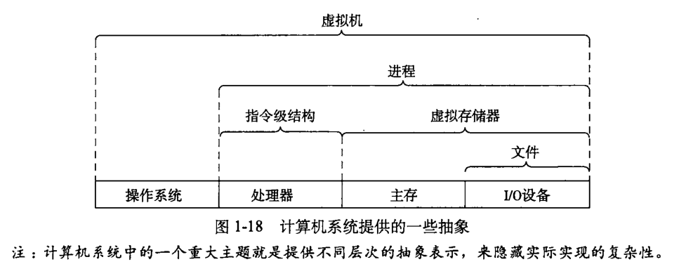
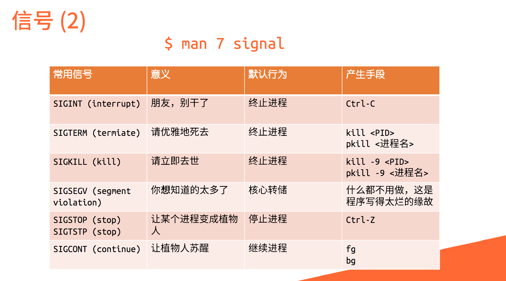

# 进程、前后台、服务与例行性任务

!!! Failure "本文目前尚未完稿，存在诸多未尽章节且未经审阅，不是正式版本。"

本讲义前后文之间有交叉（前文可能出现后面的内容），对于初次接触相关概念的同学，为避免混乱，可以<a href="javascript:void(0)" onclick='$(".more").hide(); $("details[open] summary").click(); $("//a[href=\\.\\.\\/1-supplement\\/]").hide()'>将这些内容隐藏</a>。第二次回顾时通过<a href="javascript:void(0)" onclick='$(".more").show(); $("details:not([open]) summary").click(); $("//a[href=\\.\\.\\/1-supplement\\/]").show()'>显示细节</a>，建立上下文更深层的连系。

当然如果你已经对这些概念比较熟悉，欢迎直接浏览完整版。

本节内容将不可避免遇到以下名词：操作系统，内核（kernel），shell，中断，系统调用...建议阅读 intro 文档后浏览本章内容。

!!! abstract "摘要" 
    进入 Linux 的世界，便意味着与系统管理直接打交道，无法像在 windows 中一样独善其身。系统正在做什么？我们如何给系统安排任务？本章将要带大家走进进程，进而实现 Linux 更高级的自动化。
    
    其实应当坦言，对于许多仅仅是想应用Linux的同学而言，似乎系统层面的细节离自己需要的功能很远，不必加以理会。如果仅仅是以“个人使用”为目的，也许知道如何在程序失去响应时把它干掉就足够了。然而同学们有没有好奇过，我们为什么要装操作系统？重点是，为什么又装了一个Linux操作系统？简言之，操作系统可以帮程序“善后”，让程序过上“衣来伸手，饭来张口”的日子。而不同的操作系统会使用不同的策略和机制去提供相同的服务，策略机制的不同又体现着其服务理念的差异。当你大致了解Linux的机制时，“为什么”将自有答案。
    
    Linux的特性，还需从操作系统管理进程的功能说起······

## 进程 {#process}
**现在设想你有一堆任务在一周之内完成，应该如何下手呢？**

一些情况下，我们或许会随机选择一个做，但也许拿出日历，根据轻重缓急排出一个先后来更为合适。计算机同样面临着繁多的事务，CPU 的时间也同样需要被安排。

**那么在计算机中，操作系统又是如何实现各项工作的安排呢？**

!!! tip "管理工作需求的产生"
    在最早期的晶体管计算机时代<ref>，没有操作系统，由操作员负责输入输出，意味着处理单元的时间在等待 IO 的过程中浪费。可见，只有让任务之间衔接得足够快，才能更好地利用处理器性能。当时采用批处理策略集中任务，并由一个处理程序负责加载程序，录入数据，输出结果。这种按录入顺序装载程序并负责 IO 的处理工作的程序便成为操作系统的雏形。

在以上过程中，操作系统直接面临的就是一个个等待运行的任务，随后演变为**进程**。


??? info "任务（task）与进程（process）"
    事实上，任务只是那么一段需要运行的代码（重点强调完成一件事），而进程是一个任务管理意义上的实体，不仅包括代码，还有自己的状态信息（下面介绍）。


**进程**是计算机系统三大抽象之一，操作系统秉承“为进程服务”的理念而设计。



程序由数据结构和算法构成，程序需要存储资源安身，需要计算资源运行。而一个程序占有资源并运行便成为了进程。程序希望有 CPU 运行它，希望它需要的数据唾手可得，希望输出的数据可以被正确及时地送达。早期的系统不需要操心进程运行的顺序。然而随着人们对计算机需求越来越高，操作系统除了为进程提供基础服务之外，更需要管理好进程所竞争的资源，甚至要为实时交互提供方案。

??? tip "需求推动操作系统的发展（一点题外话）"

    早期采用单道批处理策略的计算机如果有程序等待 IO，处理器只能傻等。为了更高效地利用处理器，出现 **多道程序设计**方案，允许充分利用程序 IO 的时间；为了响应实时性要求，出现了**中断(interrupt)**概念<ref>，响应硬件软件中断执行任务的请求；为了实现多人共用，出现了**分时系统**概念，虽然最初是对用户的分时，但与现在对进程的分时策略一致······正是这些逐渐增长的需求确定了现代操作系统需要解决的问题。

**有了进程的抽象后，操作系统又将如何以进程为单位，协调并保证工作的顺利进行呢？**

（注：以下内容建议使用 `sudo apt install htop` 安装并运行 htop，即时查看进程的各个属性。同时伴随 htop 的应用讲解）


<p class="caption">htop 示例 | <abbr title="链接到 htop 主页">[htop HomePage➚](https://hisham.hm/htop/)</abbr></p>

### Process ID {#pid}

首先，有区分才有管理。进程号（PID）作为进程的唯一标识，便是身份证号一般的存在。在htop中，最左侧一列即为 PID。当系统想要调度进程，或者用户想挂起，继续或终止进程时将使用 PID 作为索引。

_在图形界面上，直接单击绿色条内的 PID 栏，可以将进程顺序按照 PID 序列排列，再次点击为反向排序，同理可应用于其他列。_


**那么，PID 又是如何产生的呢？**

很简单，使用一个变量做计数器从零开始增加就可以了。早期的 Linux 版本中，PID 最大值为 65535，即 PID 变量为 C 语言 short 类型。虽然有一些程序中途退出，但系统执着地按照计数变量加一的方式赋给进程 PID。超过上限后会从用户进程 pid 最低值重新分配没有占用的进程号，直到全部占满。然而编者现在版本的内核该变量相当于 int 类型，所以进程号有时看起来会很大。

??? tip "Linux 进程启动顺序"

    按照 PID 排序时，我们可以观察系统启动的过程。Linux 系统内核从引导程序接手控制权后，开始内核初始化，随后变为**init_task**，初始化自己的 PID 为 0。随后创建出 1 号进程（init / systemd）衍生出用户空间的所有进程，创建2号进程 ktheadd 衍生出所有内核线程。随后 0 号进程成为 idle 进程，1 号，2 号并非特意预留，而是产生进程的自然顺序使然。

    _由于 ktheadd 运行于内核空间，故需按大写 K（Shift + k）显示内核进程后才能看到。然而无论如何也不可能在 htop 中看到 0 号进程本体，只能发现 1 号和 2 号进程的 PPID 是0。_

### 进程组织结构 {#process-struct}

#### 进程父子关系 {#parent-child}

除了最开始的0号进程外，其他进程一定由另一个进程通过 fork 产生，显然产生进程的一方为父进程，被产生的是子进程。在 Linux 中，父进程可以等待子进程，接收子进程退出信号以及返回值。

父子关系引出了两种运行情况——父进程先去世和子进程先去世，产生孤儿进程（orphan）和僵尸进程（zombie）现象。孤儿进程（即留下的子进程）由操作系统回收，交给 init 领养（图形界面时有点不同）；而僵尸进程来自于退出状态名称（对应子进程结束而父进程未查看情况），此时进程资源大部分已释放，但占用一个 PID（上文已述，PID 个数有上限），并保存返回值。系统中大量僵尸进程的存在将导致无法创建进程。同时，进程一般不能主动脱离父子关系（至少没有改变父子关系的系统调用），只能由于进程一方退出执行才会发生关系变动。

#### 进程组 {#pgroup}

进程组大体上是执行同一工作的进程形成的一个团体，通常是由于父进程 fork 出子进程后子进程继承父进程的组 ID 而逐渐形成。设计进程组机制主要是面向协作任务，比如 Firefox 工作是网页浏览，那么其相关的进程一定属于一个进程组。<span class="more">进程组的出现方便了系统信号管理，后面可以看到，发给一个进程组的信号将被所有属于该组的进程接收，意义就是停止整个工作整体。</span>

#### 会话——前台与后台 {#session}

而会话（<abbr title="来自拉丁语 sedere，坐，坐下，词源同 sit。用坐下——起身来指代一场，一节，一个阶段。这里就是登陆到退出。">session</abbr>）可以说是面向用户登陆出现的概念。当用户从终端登陆进入 shell，以该 shell 为会话首进程展开本次会话。<span class="more">（所以守护进程一经创建会脱离当前会话，以自己 PID 为 session ID。）</span>session 中包含着 n 个进程组，分别完成不同的工作。用户退出时，session 不一定会结束，有些进程仍然可以驻留系统中，以该 session ID 继续运行。

说到会话，就必然涉及到 Linux 会话中的前后台管理机制。前台（foreground）与后台（background），本质上决定了是否需要与用户交互，对于单独的一个 shell，只能有一个前台进程（组），其余进程只能在后台默默运行，上述中 n 个进程组，正是前台进程组和后台进程组的概称。在稍后部分中我们将学习前后台的相关操作。

_按 F2，随后可以自主选择进程的属性列在面板上，以 Parent PID 为例（PPID），点击 colomns，点击 PPID，注意到下方提示 F5 add 添加到左侧，再依照下方提示调整顺序。同理可以顺便在 PPID 后顺序添加 PGRP，TTY\_NR，TPGID，SESSION 列以便观察下面实验结果。_


（F10 被终端程序占用了怎么办？其实终端上的选项是可以用鼠标点击的，点一下 Done 即可返回。）


??? example "小实验"

    通过以下实验，我们可以尝试使用 fork 系统调用体验建立父子进程关系。

    打开任何一个文本编辑器（或者之前安装的 VSCode），将以下内容复制粘贴进去，命名文件为 `forking.c`：

    ```c
    #include<stdio.h>
    #include<unistd.h>  //unix standard header，提供 POSIX 标准 api

    int main(){
        for (int i = 0; i < 3; i++)
        {
            int pid = fork();   //fork 系统调用，全面复制父进程所有信息。
            if (pid == 0)   //子进程返回 pid=0。
            {
                printf("I'm child, forked in %d turn\n", i);
            } else if (pid < 0) //fork 失败，pid 为负值。
            {
                printf("%d turn error\n", i);
            } else  //父进程返回子进程 pid。
            {
                printf("I'm father of %d turn, child PID = %d\n", i, pid);
            }
            sleep(3);
        }
        sleep(1000);
        return 0;
    }
    ```

    随后，在文件所在目录下打开 shell，运行 `gcc forking.c -o forking && chmod +x forking && ./forking` 三连，就可以在另一终端打开 htop 查看成果了。

    

    按下 T 键，界面显示的进程将转化为树状结构，直观描述了父子进程之间的关系。此处可以明显观察到树梢子进程的 PID 等于父进程的 PPID。

    同时由 shell 进程创立的 forking 进程的进程组号（PGRP）为自己的 PID，剩余进程的 PGRP 则继承自最开始的 forking 进程，当然 PGRP 可以通过系统调用修改为自己，从原进程组中独立出去另起门户。

    接下来会看到进程 SID 一律为该进程的控制 shell 的 PID。<p class="more">随后观察守护进程，可以看到守护进程的 SID 一般是其本身 PID。</p>

### 优先级，NICE 值 {#priority}

有了进程，谁先运行？谁给一点时间就够了，谁要占用大部分 CPU 时间？这又是如何决定的？这些问题之中体现着优先权的概念。如果说上面所介绍的的那些进程属性描述了进程的控制信息，那么优先级与 NICE 值则反映操作系统调度进程的核心手段。

优先级思想很简单，为任务的重要程度排一个序，任务越紧急，数值越低，越排在前面。而 NICE 值更加直白，数值越大说明程序<s>人品越高尚</s> ——我是说越要懂得谦让。

而调度这个词，指的正是我们一开始所提及的，安排各进程运行顺序及时长的过程。（严格定义：调度是分配工作（进程）所需资源的方法。）

!!! info "协作与抢占"
    实际上，并不是所有的操作系统都去操这个心，有的操作系统从来不管 CPU 怎么用：只要程序不放弃 CPU，就可以一直运行下去。这种操作系统为协作式（cooperative）操作系统，而这往往意味着操作系统中软件之间高度耦合，互相考虑。但我们日常中经常使用不同来源的软件，不可能为彼此考虑周全。为了保证这些软件之间资源分配的公平性，显然必须引入轮流调度算法，分配时间片（time slice），让每个进程在一定时间内都得到运行。这种运行模式的操作系统便称为抢占式（preemptive）操作系统。

系统进行调度，主要面临这样几个问题：

- 何时（什么契机）可以进行调度？
- 要不要进行调度切换进程？ 
- 该调度谁？

首先若想进行调度，必有中断参与。简言之，中断即是为了能够让操作系统或是其他程序切入运行状态程序所提供的机制。而调度过程本身即是打断正在运行的程序，唤起另一个程序的过程。没有中断，操作系统都无法介入运行，如何切换进程？可见，操作系统必然在有中断时进行调度。<span class="red">此处应有引用</span>那么 Linux 系统如何利用中断进行调度呢？

已知我们一需要轮流调度算法，二需要支持高优先级抢占低优先级与事件驱动。则系统必然需要在周期性的时钟中断到来时，重新执行一遍调度，查看当前进程的时间片是否使用完毕，以及是否有高优先级程序已经准备就绪。而为了达成事件驱动，系统在一些其他中断发生后，也需要进行例行调度检查，如果响应该中断的程序更紧急，应当立即执行。

如上调度策略一旦确定，则三个问题迎刃而解：

- 在中断发生时进行调度。
- 时间片使用完或有高优先级的任务就绪时选择切换进程。
- 将高优先级任务投入运行，直到程序因时间片用完或其他原因挂起。

以上内容听来似废话，然而这正是操作系统调度的核心（单核模型）。我们刚刚得到结论，调度算法的行为取决于时间片和优先级。它们是如何确定的，是固定的吗？

??? info "属性列表总结"

    <div class="md-typeset__table"><table>
    <thead>
    <tr>
    <th>进程属性</th>
    <th>意义/目的</th>
    </tr>
    </thead>
    <tbody>
    <tr>
    <td>PID</td>
    <td>标识进程的唯一性</td>
    </tr>
    <tr>
    <td>PPID</td>
    <td>标识进程父子关系</td>
    </tr>
    <tr>
    <td>PGID</td>
    <td>标识共同完成一个任务的整体。如果子进程完成的任务与父进程迥异，应当重设其 PGID</td>
    </tr>
    <tr>
    <td>TPGID</td>
    <td>标识一组会话中与用户交流的进程（组）</td>
    </tr>
    <tr>
    <td>SID</td>
    <td>标识一组会话，传统意义上标识一次登陆所做的任务的集合，如果是与具体登陆无关的进程，其 SID 被重置</td>
    </tr>
    <tr>
    <td class="red" colspan="2">以上除 PID 的其他属性，ID 值实际为父进程，组长进程，会话首进程的 PID。以上概念囊括范围递增。</td>
    <td></td>
    </tr>
    <tr>
    <td>USER / UID</td>
    <td>标识进程的权限</td>
    </tr>
    <tr>
    <td>Priority</td>
    <td>标识进程的重要性，值越小越得到优先处理</td>
    </tr>
    <tr>
    <td>NICE</td>
    <td>标识进程的好坏程度（×），值越大进程越具有谦让精神（√）</td>
    </tr>
    </tbody>
    </table></div>


## 用戶进程控制 {#process-control}

要想控制进程，首先要与进程对话，那么首先便需要了解进程间通信机制。由于进程之间不共享内存空间，也就无法直接发送信息，必须要操作系统帮忙，于是信号机制就产生了。

### 信号 {#signal}

“没有消息就是最好的消息”，如果进程突然接到信号，多半是废了。连我们发送信号的 Linux 命令都叫 `kill`，可见进程凶多吉少（大多数信号默认操作都是各种退出）。

那到底都有什么信号呢？emmm... `man 7 signal`？

可这实在是太长了，还是来一个简明实用的吧。那么，



（来自上一次 Linux101——进程、服务、任务的 slide 截图）
{: .caption }

### 前后台切换 {#bg-fg}

上面的图片中，出现了 `fg`, `bg` 和 Ctrl + Z，涉及到的正是 shell 中前后台的概念。在 shell 中直接运行命令，将挂到前台，而如果不希望无力地看着屏幕输出不能做其他事情，那么便需要将程序切换到后台了。

前后台切换的一般流程是，使用 Ctrl + Z 发送 SIGTSTP 使进程挂起，控制权还给 shell，此时屏幕输出如下所示，即（刚才挂起的进程）代号为2，状态为 stopped，命令为 `ping localhost`。

<div id="part"></div>

emmm···为什么不是[1]呢？看来应该是这个 shell 前面已经挂起了一个进程。那么我们<a href="javascript:void(0)" onclick="$('#part').css('height', $('#bg').width()*236/618 + 'px')">使用`jobs`命令（click）</a> ，就可以看到当前 shell 上所有前台的、后台的、运行的、挂起的进程了。

任务前的代号在 fg，bg，乃至 kill 命令中发挥作用。使用时需要在前面加`%`，如将2号进程放入后台，则<a href="javascript:void(0)" onclick="$('#part').css('height', $('#bg').width()*290/618 + 'px')">使用`bg %2`</a>，效果如图所示。

!!! info "一点细节"
    然而我们也许会关注一个细节，在图中显示的编号后面跟着的加号和减号是什么？加号标记了 fg 和 bg 命令的默认选项，像上面的命令也可以直接简化为 `bg`。减号表示如果加号标记进程退出，将会成为加号标记进程。同时这两个进程也可以被 `%+`（或 `%%`）、`%-` 指代。当然，加号减号都只能出现一次。

在 htop 中，按照前面的提示添加额外的 TPGID（前台进程组号）列可以看出如图所示的规律：


即一个 shell 及其创建的所有进程都知道 shell 中前台进程是谁。

### 干掉进程 {#kill}

正如上所述，许多信号都会引发进程的终结，然而标准的终止进程信号是 SIGTERM，意味着一个进程的自然死亡。

!!! info "SIGTERM、SIGKILL"

    root from bash：发送 SIGTERM 给 PID 为1234的进程。

    kill：发送系统调用告诉内核，把 SIGTERM 传给1234进程。

    内核（被调用唤醒）：发送 SIGTERM？有权限吗？哦是 root 啊，那没问题。</br>（把 1234 进程的信号标志位设为 15，留言：“上面下来通知，你可以滚蛋了，别忘了把自己堆栈收拾立正再走。”）

    （调度器轮到 1234 号进程）1234：呦，有信号来了，哦，是 SIGTERM 啊，但很遗憾，这个信号在我这里是忽略的。

    <-- 一会后 -->

    root：进程怎么还没结束？那只好 SIGKILL 了。

    kill：发送系统调用告诉内核，把 SIGKILL 传给 1234 进程。

    内核（被调用唤醒）：什么？发送 SIGKILL？有权限吗？哦是 root 啊，那没问题，1234 没有运行的机会了，我会亲自清理重置它的堆栈，删掉进程描述符，顺便告诉它爹这个不幸的消息。

    （SIGTSTP、SIGSTOP 也是一样的道理，前者可以由用户按 Ctrl+Z 产生，程序可以见到，后者程序由操作系统强制挂起，无法被程序抗拒。）

那么问题来了，如何才能创造一个向上面一样流氓的进程呢？

??? example "小实验"

    打开任何一个文本编辑器（或者之前安装的 VSCode），将以下内容复制粘贴进去，命名文件为 `signal_handle.c`：

    ```c
    #include<stdio.h>
    #include<signal.h>   //定义了变更信号处理函数的方法以及一些信号对应的整数（如 define SIGTERM 15）
    #include<unistd.h>   //sleep 函数位置

    void sig_handler(int sig);  //设置一个处理信号的函数

    int main(){
        signal(SIGTERM, sig_handler);   //替换默认终止信号处理例程
        //signal(SIGINT, sig_handler);  //以下内容可随意尝试：//替换键盘中断（keyboard interrupt）处理例程
        //signal(SIGHUP, sig_handler);                      //替换控制进程挂起信号处理例程
        //signal(SIGKILL, sig_handler);                     //替换···不存在的！

        while (1)
        {
            sleep(10);  // do something
        }   
    }


    void sig_handler(int sig){
        printf("hi!\n");  // 皮一下
        //fflush(stdout);   //如果你的输出内容不包括回车，或许需要刷新缓冲区才能看到效果。
    }
    ```

    随后，在文件所在目录下打开 shell，运行 `gcc signal_handle.c -o signal_handle && chmod +x signal_handle && ./signal_handle` 三连，就可以在另一终端打开 htop 查看成果了。

不过···我们的程序去哪了？别急，按 F3 或者 `/`，都可以实现搜索。（`/`是许多界面如 vim、man、aptitude 的默认搜索键）

### 一些其他的发送终止信号的方式 {#more-kill}

!!! warning 

    以下命令请勿生产环境中使用。

        sudo kill -9 -1

其实 kill 命令在部分发行版上有约定，<s>负数 PID 死全家</s>，但 `man kill` 只介绍了 `-1` 参数。（负号还可以理解为参数选项）

简单介绍一下 kill，在靶机上 root 执行 kill -9 -1

!!! question "思考"

    如何描述用户按下 Ctrl+C 后系统与进程响应全过程？（提示：需使用中断，键盘缓冲，系统调用，信号机制，信号处理等关键词描述）

    答：键盘按下 Ctrl，CPU 将接到键盘中断，将键盘扫描码（代表按键）码放入键盘缓冲，随后 C 键扫描码，断码（代表抬起），以及 Ctrl 断码依次放入缓冲区。

### 后台任务 {#background-task}

####nohup

如果 tty/pty 被关闭，则前后台进程一起收到 SIGHUP，如果 shell 被 kill -9 （SIGTERM 无效），则后台进程保留被接管。注意，shell可以主动退出，这样后台进程不收 SIGHUP。但同时注意，ssh 的初始shell不适用于此情形，如果该 shell 主动退出，不会保留后台进程。

除 nohup 外，bash 及其他的 shell 还可以有内建命令完成脱离

!!! question "问题"

    上面的示例中，`ping` 命令一直在输出，严重影响命令的输入，应如何操作？（详见流的重定向）

## 服务 {#service}

###什么是服务？

??? example "首先，n 个实验"
    1.按 `ctrl + shift + T`，新建一个页面。输入 `sleep xxx` 或者 `ping xxx`（尽量使命令得以区分），随后
        - 使用

实际上，如果我们使用类似 `bash -c "ping localhost &" &` 这样的命令就可以模拟守护进程创建的过程：首先现有 shell 创建了 bash 做为子进程，该 bash 将 `ping localhost` 放入后台执行。由于不是交互模式，没有前台进程 bash 将自动退出，该 bash 的后台进程将不会接收到 SIGHUP。

!!! info "两次 fork"


## 例行性任务 {#cron}

<!--
## 下载链接(已失效)
<div class="more">

```shell
git clone https://github.com/torvalds/Linux  #Linux 内核源码
```
</div>
-->

<script type="text/javascript">
function defer(f) {
  if (window.jQuery) {
    f();
  } else {
    setTimeout(() => defer(f), 100);
  }
}
defer(function() {
  $("#part").css("height", $("#bg").width() * 181 / 618 + "px");
});
</script>

<style>
#part{
  height: 0;
  overflow: hidden;
}
</style>
