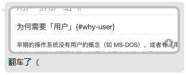

# 章节编写指导（标题请用 h1 等级编写。）

!!! warning "本文面向编写组提供指导和规范，不面向读者阅读，不属于本书正文。"

!!! abstract "导言"

    在每一章的开始都需要编写章节导言。导言的目的有两个：一是为了铺垫一些前置知识以方便后续展开正文；二是写出一个内容摘要来辅助读者和编者自己快速了解该章节的核心内容和脉络。编写导言时可以自己组织语言，以简练为主，不需要面面俱到。

    “章节编写指导”是一份写给该讲义的创作者所用的参考教程。在接下来的编写中，推荐在本地也安装一个 MkDocs 来实时预览项目。MkDocs 基于 Python，故可以使用诸如 `pip install mkdocs` 等命令完成安装。更全面的安装流程请参考 [MkDocs 官网安装说明](https://www.mkdocs.org/#installation) 实现。

    使用形如 `!!! abstract "导言"` 的方式添加一个导言框，并在下面若干行通过缩进 1 个制表符或 4 个空格的方式填写导言里的内容，行与行之间请空 1 行。

!!! info "Markdown 格式注意事项"

    目前 CI (GitHub Actions) 在部署文档时，额外添加了使用 [Prettier](https://prettier.io) 检查 Markdown 风格的步骤，如果不符合要求，你的修改会被拒绝。请在编辑完成后使用 Prettier 检查并修复 Markdown 格式。

    可以在仓库根目录使用 `npm install` 安装 Prettier，使用 `npm run check` 检查文件格式，使用 `npm run fix` 修复。

## 章节主体（主体内容请从 h2 等级以下按层次编写。） {#main-content}

章节里的主要内容都应该写在主体里。主体包括标题和正文：标题都从 h2 等级以下按层次编写，而正文则直接使用普通文本即可。

主体里应当包括与该章节主题相关的详细内容，具体内容依赖于课纲。建议每个 h2 等级的标题都包含一个完整的子模块，不同的 h2 子模块的内容尽可能没有强烈的依赖。这个标准同样适用于 h3 及以下的子段落。

每一段主体应当有完整的内容、正确的逻辑和通顺的文字。请尽力避免诸如知识点依赖链缺失、逻辑错误和文笔零碎等影响读者阅读体验的问题。建议每次写完以后通过想象自己正是读者进行阅读的方式来查漏补缺，也可以通过同行交叉审阅的方式获取宝贵的建议。

### 在本地随时预览当前主题下的格式 {#local-preview}

目前当前的主题已经确定为 Material，可以使用诸如 `pip install mkdocs-material` 等命令完成主题的安装，并在工作根目录下使用 `mkdocs serve` 命令并访问 <http://127.0.0.1:8000> 来实时预览，这对讲义的编写十分有帮助。

更全面的安装和配置信息请参考 [MkDocs 官网](https://www.mkdocs.org) 和 [Material for MkDocs 官网](https://squidfunk.github.io/mkdocs-material/)。

### 善用提示框让正文主次分明 {#use-admonitions}

通常来说，主体要包含的内容如果需要写得很详尽，不免会带来主次不分的问题。因为很多知识点的结构很接近有向无环图，而文字毕竟都是线性的。非要说使用拓扑排序虽然可以保证不会出现知识点依赖编写颠倒的问题，但也难以让读者快速分析出主干和枝节。

请善用提示框，让读者对内容的主次、成分一目了然，也能让你的作品层次更加丰富。

!!! info "重点"

    建议用这种提示框来划出重要的知识点，可以是一段内容的核心总结。

    使用形如 `!!! info "重点"` 的方式添加一个重点框。

!!! example "范例"

    建议用这种提示框来列出一个范例。

    使用形如 `!!! example "范例"` 的方式添加一个范例框。

!!! tip "小知识"

    建议用这种提示框来在保留正文连贯性的同时添加细枝末节的知识。

    使用形如 `!!! tip "小知识"` 的方式添加一个小知识框。

!!! warning "请在提示框的标题行后面留一个空行"

    由于 Prettier 的解析方式问题，请在所有提示框的起始行后面添加一个空行，**不要像 Material 主题官网那样没有空行直接开始提示框内容**。

    :fontawesome-solid-times-circle:{: .orangered } **错误**格式：

    ```markdown
    !!! note
        提示框内容
    ```

    :fontawesome-solid-check-circle:{: .limegreen } **正确**格式：

    ```markdown
    !!! note

        提示框内容
    ```

更多种类的提示框请参考 [提示框一览](https://squidfunk.github.io/mkdocs-material/reference/admonitions/)。

### 为标题和小标题添加 ID {#heading-ids}

由于文章篇目较长，使用时会经常遇到需要链接到文章某一段的情况。受限于 MkDocs 自动生成 Anchor ID 的功能（只支持英文字符），纯中文的标题会导致生成 `_1`, `_2` 这样的 ID。一方面这样的 ID 看起来不直观，另一方面每当标题发生增减时这些 ID 都会变，因此请为每个标题手动添加一个有意义的 ID（最开始的标题 H1 除外），方法如下：

```markdown
### 为标题和小标题添加 ID {#heading-ids}
```

建议 ID 只包含小写字母、数字和横线 `-`，必要时使用句点（不使用大写字母和其他标点符号）。

!!! warning "注意"

    `{#` **前面**需要有一个空格，否则你会像下面这位同学一样翻车：

    

    出于风格一致性考虑，请不要在 `{#` **后面**加空格：

    ```markdown
    ✔ ### 为标题和小标题添加 ID {#heading-ids}
    ❌ ### 为标题和小标题添加 ID {# heading-ids}
    ```

!!! warning "注意 2"

    请不要在每页最开始的标题（唯一一个 H1）后添加 `{#id-tag}`，否则可能会出现一些意料之外的显示错误。

### 为图片添加配字 {#image-caption}

在图片下方写一行文字作为配字，并在这行字**紧接着的下一行**（不能有空行）写上 `{: .caption }`，这样配的这行字渲染成 HTML 时就加上了 `class="caption"`，显示为 0.94 倍的字体、灰色、贴近图片。

```markdown


图 1. 这张图片的一行配字
{: .caption }
```

## 自主阅读节 \* {#extra-reading}

可以在章节主体中包括若干自主阅读节，原则上这一部分的结构与其它章节主体并无不同，只是不会在课堂上讲授。

在所有自主阅读节的标题后面打上星号 \* ，并建议尽可能放在后面。

## 思考题 {#thinking-question}

建议在每一章后设计若干思考题，来帮助读者投入到一些实际问题的思考中。好的思考题推荐从实际需求中采集灵感，并且拥有简单的题干和典型的解决思路。

!!! question "如何得到代表思考题的提示框？"

    建议使用这样的提示框可以用来表达一个思考题。

    因此使用什么样的命令能生成这样的提示框呢？（请参考源码，或者上文给出的提示框一览链接。）

建议不要直接把答案放在每个问题下方，可以专门编写一份思考题解答页面集中放置。

## 拓展阅读 {#further-reading}

Linux 的知识结构呈非线性，仅有单线的正文是不足的。请广泛查阅与本章相关的资料，根据实际需要为读者适当规划一些与本章相关的额外知识，并随附优质的教程、百科等资源（如有），供感兴趣的读者进一步阅读。拓展阅读放置在与正文平级的 `supplement.md` 中，每个独立的额外知识点都是一个 h2 等级节。

!!! warning "额外前置知识警告"

    为了保证编写思路不受限，以及鼓励读者多多自行学习，拓展阅读可以依赖后续章节和本书规划内容以外的知识。如果存在这种情况，请在对应的节标题下面紧跟一个警告提示框，指出所依赖的知识（书内或书外）。警告形式如下：

    本节拓展内容依赖如下额外的前置知识，建议先阅读并掌握对应内容后再研读本节：

    * [第一章 中科大开源社群：LUG@USTC](../Ch01/index.md)
    * [LUG@USTC 官方网站](https://lug.ustc.edu.cn/)

## 引用与脚注 {#reference-footnote}

脚注用于在正文尾部注明一小段内容的的来源引用链接或者是进行**不重要**的说明。[^1]因为重要的说明最好直接跟在后面解释或者在段落后面用提示框，以免破坏读者阅读的连贯性。

引用框则用于在正文和拓展内容中引用他人的言论或指出外链。

!!! quote "中文文案排版规范"

    请参考 [该规范](https://github.com/sparanoid/chinese-copywriting-guidelines/blob/master/README.zh-CN.md) 来统一最基本的中英文排版格式。

    使用形如 `!!! quote "小知识"` 的方式添加一个引用框。

[^1]: 不重要的说明如：某些名词的来历、解释（缩写的）术语、一些题外轶事和插曲等。
